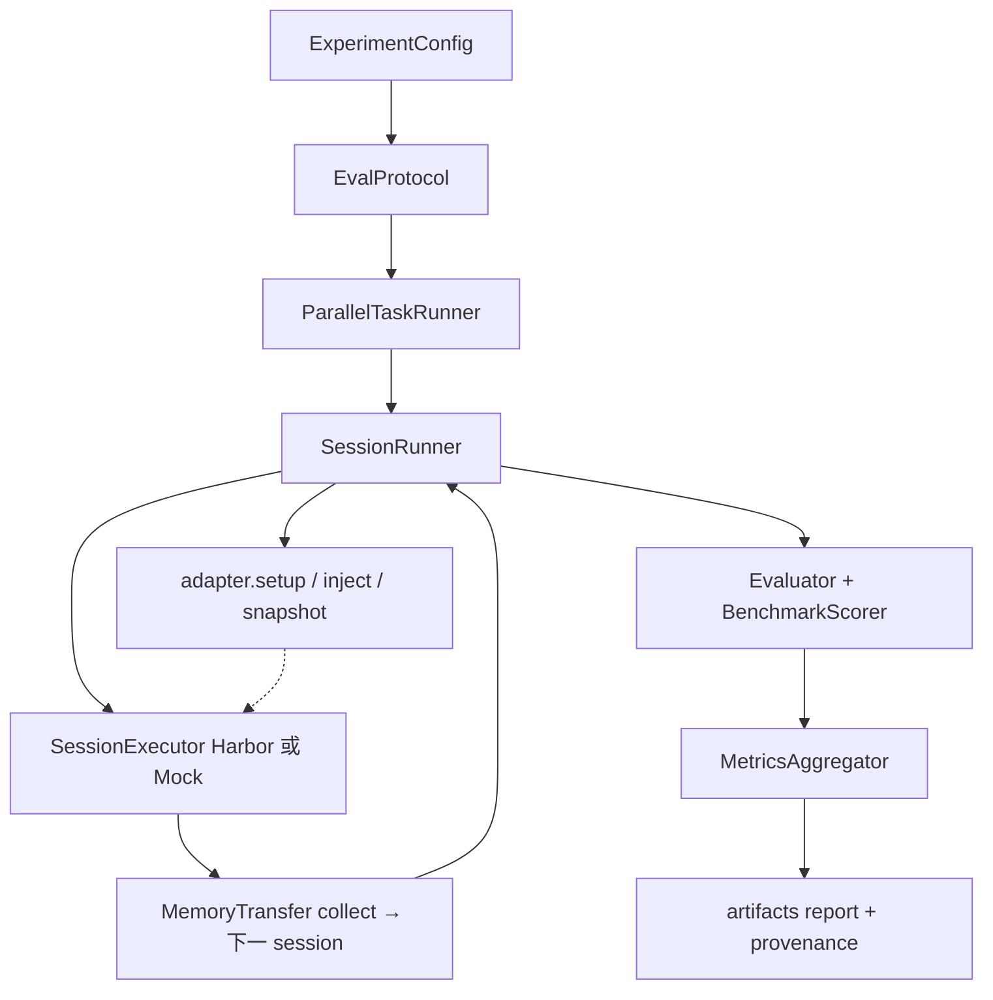
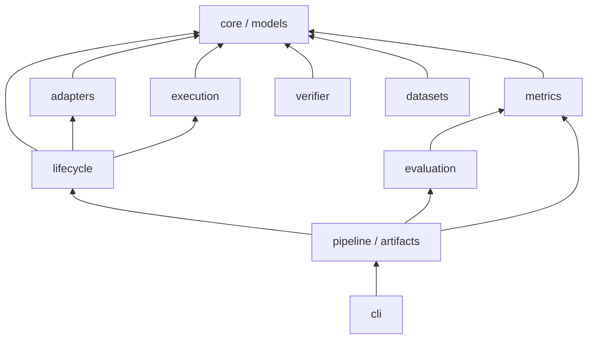

# DuMemEval 目标与分层契约

本文是**社区贡献的权威入口**。实现细节见代码；这里只锁三件事：测什么、改哪一层、禁止碰什么。

## 一句话目标

> **评测「带记忆的 Agent」：在隔离环境里，跨 session 地记、取、用——记什么是 agent 的自主决策，不是批量灌入；同时报告 Memory 质量、任务效用、系统效率；官方数据集给出可复现口径。**

不是：再做一个 15 家 memory API 的检索排行榜（那是 adapter 填满之后的下游产物）。  
不是：再做一个 AgentBench / SWE-bench 通用 agent 评测（那是 execution 引擎可替换，不是本框架主循环）。

## 评测循环（不要改这条主链）

```
ExperimentConfig（校验）
  → EvalProtocol（决定每个 session 是否 inject / snapshot / collect）
    → ParallelTaskRunner（task 间并行；task 内 session 串行）
      → SessionRunner
        → adapter.setup / seed_history / inject / snapshot / observe
        → executor.run_session（Harbor 或 Mock）
        → MemoryTransfer.collect → 下一 session inject
    → Evaluator（TaskExecution → samples / BenchmarkScorer / MetricsAggregator）
    → ReportGenerator
```

加能力 = 实现某个扩展点并 `register_*`。**不要**在 `SessionRunner.run` 里加 `if backend == ...` / `if benchmark == ...`。



## 分层（单向依赖）



硬禁区：

| 禁止 | 原因 |
|---|---|
| `execution` import `adapters` | 执行器只跑 agent，不感知 memory 产品 |
| `lifecycle` import Harbor 实现类 | 只依赖 `SessionExecutor` 协议 |
| `metrics` 依赖 adapters / execution 实现 | 计算器只接收 `MetricInput`（`task` + `TaskExecution`）。`EvalResult` 不是指标层输入 |
| `adapters` import `verifier` | 瞬时重试用 `core.retry` |
| 在 ingestion / runner 里写 `if lib == "mem0"` | 产品差异封进 adapter |
| 执行器里读产品专有键（如 `hermes_*_mount`） | 统一走 `memory_mounts` 契约，见 `docs/adapters/memory-injection-contract.md` |

模块超过 300 行是拆分信号，不是硬失败。

## 五个扩展点（社区只改这些）

| 你要加 | 实现 | 注册 | 不要改 |
|---|---|---|---|
| Memory 后端 | `BaseMemoryAdapter` 子类；**`inject` 必须写 `memory_mounts` 或 `agent_env`** | `register_adapter(type, module, class)` | `MemorySpec` 不必改；`SessionRunner` 不必改 |
| 评测协议 | `EvalProtocol` 子类（`validate` + `should_*`） | `register_protocol(Cls)` | 不要把语义写进 runner 的 if |
| 数据集 | `BenchmarkAdapter`：`build_tasks()` 产出 `EvalTask` 列表 | `@register_benchmark` | 不要手写 ingest/search/eval 六段脚本 |
| 官方指标 | `MetricCalculator` 子类（`name` + `kind="benchmark"`） | `register_calculator(Cls)` | 不要改 `get_benchmark_calculator` 的分支（已无分支） |
| 任务环境 | `TaskEnvironmentProvider` 子类（endpoint / usage_hint / env_vars） | `register_task_environment` | 内置 `http` 是通用模板；webshop 等官方 server 接入见 `docs/execution/task-environment-layer.md` |

横切四维（Quality / Utility / Efficiency / Trace）每场都算，不按数据集开关。数据集只追加**官方口径**，不覆盖四维语义。

`inject` 必须写出通道，由 `tests/test_adapter_contract.py` 检查，避免 memory 没进 agent 却报成功。`memory.type: none` 除外：它故意不写通道，测试里放在 `_NOOP`。

## 指标语义（勿过度解读）

- **Quality.precision**：当前是「含任一 GT fact 的 memory 文件占比」，不是 HaluMem 论文那种逐条标注 precision。
- **Quality.update_accuracy**：未实现时为 `None`（报告 n/a），不是 0。
- **Utility.memory_conditioned_gain**：需要对照基线（`test_only` vs 有 memory）；单次评测经常为 0。
- **SessionOutcome.success / utility.success_rate**：含义是「session 跑完且采集到可判分的输出」，**不是任务做对**。容器 verifier 默认是 no-op（判分在 host），Harbor reward 不参与 success 判定。
- **Utility.task_success**：有 benchmark 官方口径时 = pooled 主分 ≥ 0.5（任务结果）；无口径的自定义任务 = 全部 session 完成。两者语义不同，看 details 里的 `source`。
- **memory_instruction**：`location`/`proactive` 会抬高分子任务成功率——跨该配置的 run 对比时它是自变量，不是噪声。
- **mock 模式**：observation 是占位文本，分数只验证编排，不代表 agent 水平。报告必须带「不可引用」横幅。

## 报告契约（产出必须能被引用）

一次评测落盘：

- `experiment_config.json`：脱敏配置 + git commit/branch/dirty + 复现命令 + judging.num_runs
- per-task `report.md` / `result.json`：四维指标 + 官方口径 + Reproduce 块
- `summary.md` / `summary.json`：pooled 官方口径 + `metrics`（run 级扁平指标）+ 同上溯源

跨 run 比较（`dumemeval compare`）只读上面两个文件，不重跑。控制变量不一致必须进 warnings，不许静默出表。

mock 跑出来的数字**不是实验结果**。真跑之后同一套字段才可引用。尚未计量的（judge token、ANSWER context tokens、Add/Search P50）保持缺省/0，不要假装有值。

## 骨架已完成 vs 留给社区的 Task

**维护者守住：** 上述循环、分层、五个 `register_*`、pydantic 配置、mock 全链路测试。

**明确未完成（请开 Issue，不要改主循环凑出来）：**

1. 第二个真实 HTTP 产品 adapter（建议 mem0）——验证 `register_adapter`
2. 一份非 mock 的 LoCoMo 官方 F1（Harbor 真跑）——骨架的存在性证明
3. `memory_train_backup_test` 的真正 backup/restore（协议对象已在，runner 未实现）
4. `memory_conditioned_gain` 自动化：现在靠 `compare` 手动跑两臂，可做成一条命令跑 baseline+memory
5. ANSWER/EVAL 双模型 + judge token 计量
6. 阶段级 replay（现有 checkpoint 是 **task 整段**，不能从 search 之后续）
7. 用 Harbor `TrialQueue`（`submit` + `RetryConfig`）替换 `ParallelTaskRunner` 内部队列——需先包一层协议，别把 Harbor 类型引进 lifecycle
8. zep / letta / supermemory 等产品 adapter
9. streaming 逐条 add→search→delete（应是新协议或 runner 模式，禁止复制 4 份脚本）
10. Trace 体检加项：turn 溢出 / 重复动作 / 输出格式漂移（当前只有采集率、错误率、memory 是否被调用）

Issue 模板：`.github/ISSUE_TEMPLATE/`。贡献步骤：`CONTRIBUTING.md`。

**任何 PR 都必须有设计文档**（`docs/<模块>/<功能>.md`），无例外——含修 bug、重构、改配置。写法见 `docs/README.md`。
