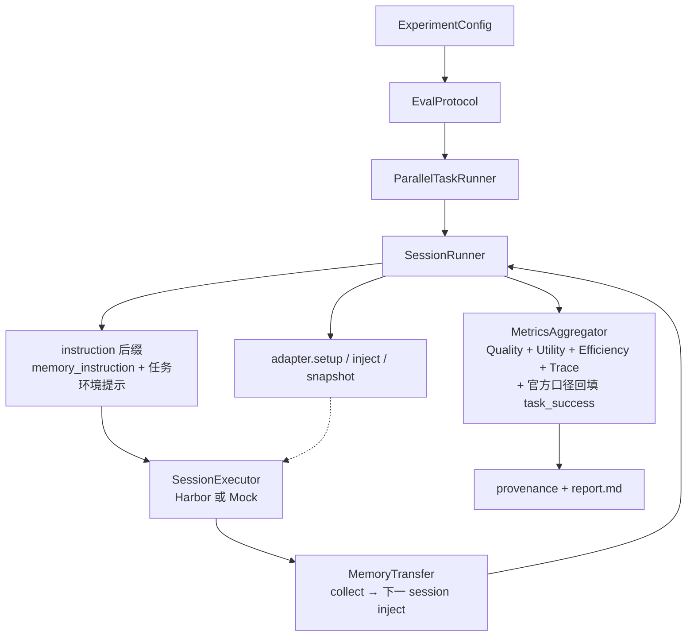
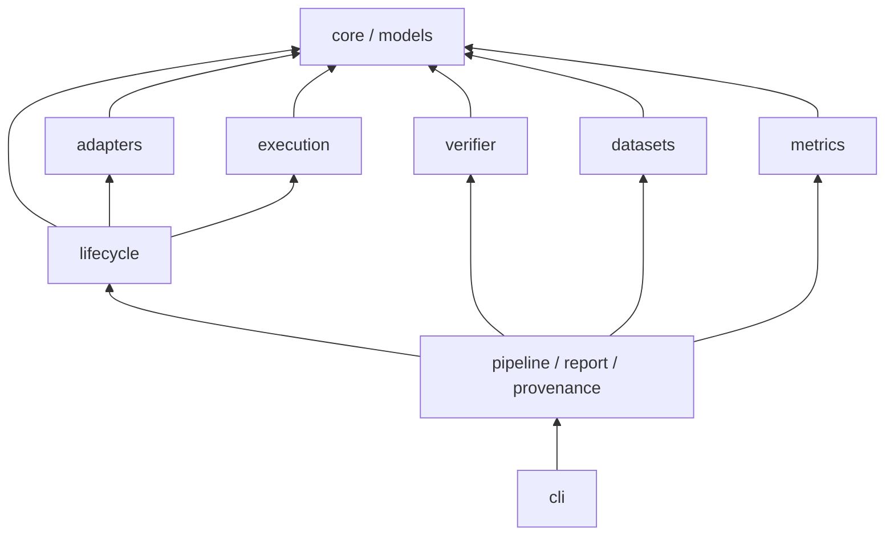

# DuMemEval

[](LICENSE)

DuMemEval 用于评测带记忆的 Agent，重点关注 Agent 如何记录、检索和使用记忆。

产品里记什么、何时取用，是 agent 自己的事。框架用协议（`memory_session_transfer` / `test_only`）编排记忆生命周期，报告四件事：memory 写对没（Quality）、任务做对没（Utility）、读写代价（Efficiency）、行为正不正常（Trace）。

数据集官方口径走各自的 calculator。需要外部环境（webshop 等）时用 `register_task_environment`，按数据集注册，支持不同类型的外部环境。


贡献先读 **[GOVERNANCE.md](GOVERNANCE.md)** 和 **[CONTRIBUTING.md](CONTRIBUTING.md)**。PR 要有设计文档（`docs/<模块>/<功能>.md`）。

不同数据集的官方评测步骤不一样，请先了解对应数据集的官方测评步骤，再写代码。

## Quick Start

```bash
# 需要：Python 3.12 + uv（https://docs.astral.sh/uv/）
make install          # 或：uv venv --python 3.12 .venv && uv sync --extra dev
make example          # 跑自带迷你数据集（无 Docker、无密钥、无需下载数据）
make list             # 已注册的 adapter / protocol / benchmark
```

`make example` 用仓库自带的 `examples/data/locomo_mini.json`（LoCoMo 格式，本项目自造），
只验证「装完能跑通」。

```bash
.venv/bin/python -m dumemeval list
.venv/bin/python -m dumemeval run --config examples/locomo_mini.yaml --mock
```

## 架构

评测循环（每个 task；task 间可并行，task 内 session 因 memory 依赖串行）：



分层（单向依赖；箭头 = 依赖方向）：



增加测评能力时，使用 `register_*`（adapter / protocol / benchmark / calculator / task_environment）。涉及 `SessionRunner` 主循环的改动，请补充设计文档。详见 [GOVERNANCE.md](GOVERNANCE.md)。

<details>
<summary>仓库目录</summary>

```
src/dumemeval/
├── cli/           # run / list / compare / prepare
├── pipeline/      # finalize_run + metrics_run + summary + run_index
├── artifacts/ / comparison/ / config/
├── core/           # 配置 + EvalProtocol
├── models/         # EvalTask / SessionSpec / 结果
├── adapters/       # directory / http / hermes_builtin / everos / none
├── lifecycle/      # SessionRunner / ParallelTaskRunner / checkpoint
├── execution/      # SessionExecutor：mock / Harbor
├── verifier/       # LLM judge / rule
├── datasets/       # BenchmarkAdapter.build_tasks
├── environments.py # register_task_environment（内置 http / webshop）
└── metrics/        # MetricCalculator + registry
configs/            # smoke/ 真跑对照 · backends/ 换后端；零依赖示例在 examples/
```

</details>

## 核心设计

### 0. 一次评测里有几层

```
Experiment（一份 config + 一个 output 目录，有 run_id）
  1 ── N  Task     数据集里互相不共享记忆的单位（locomo：一篇对话；shopping：一个购买样本）
            1 ── N  Session  本仓库里：agent 跑一轮（Harbor 一次 trial）
                      1 ── 1  Trial
```

注意「session」这个词：

- **本仓库**：一轮 agent 运行。跑之前可能 inject，跑完可能 snapshot / collect。
- **日常口语 / locomo JSON 的 `session_1`**：一段连续对话。一篇 locomo 对话在本仓库是 **一个 task**，里面有 N 段 ingest + M 道 qa，一共 N+M 轮。

locomo 一个 task 里先把各段对话喂完，再逐题问（`ingest_sessions + qa_sessions`），各段对话完成后再统一进行问答。task 之间记忆隔离，所以可以并行；task 里面有记忆依赖，session 必须串行。

### 1. Memory 生命周期（每一轮 session）
```
adapter.setup(task)                    # 清空重建，保证干净起点
for session in task.sessions:
    adapter.inject(session, ctx)       # 注入 memory 到 agent 环境
    bridge.run_session(session)        # Harbor 隔离环境跑 agent
    adapter.snapshot(session)          # 快照 memory 状态（跨 session 保留）
adapter.observe(session)               # Quality 数据
```

### 2. 统一目录语义
- 内置 memory（Claude Code / Hermes）→ **目录**（memory_dir 注入 + session jsonl 分析）
- 外挂目录 memory → **目录**
- 外挂 HTTP memory → **薄适配层**（wrap/add 协议）
- **Hermes 官方内置 memory** → **`type: hermes_builtin` 适配器**
  （对齐 hermes-agent `tools/memory_tool.py`：`$HERMES_HOME/memories/MEMORY.md`
  笔记 + `USER.md` 画像，`§` 分隔条目，session 启动冻结快照注入，add/replace/remove
  唯一子串匹配写操作，字符上限 2200/1375）
- **无外部 memory**：`type: none`。框架不接第三方 memory（不 inject、不算 Quality）。此模式只关闭 DuMemEval 接入的第三方 memory；Hermes / Claude Code 自带的 memory 由 runtime 决定。谁当 baseline 由你 `compare --baseline` 指定。见 [docs/architecture/run-artifacts.md](docs/architecture/run-artifacts.md)。

### 3. 两层指标体系

**公共四维度**（所有评测共有）：
- **Quality**：precision / recall / hallucination_rate / omission_rate / update_accuracy —— memory 本身写对没
- **Utility**：task_success / success_rate / memory_conditioned_gain / turns / cost —— 记住之后任务有没有变好
- **Efficiency**：write_latency_ms / retrieval_latency_ms / tokens / cost —— 读写代价
- **Trace**：trace_captured_rate / empty_output_rate / error_rate / memory_tool_used —— agent 行为是否正规（memory 配了但一次没调 = `memory_tool_used=false`）

**Benchmark 官方指标**（按数据集路由到 metrics/ 各 calculator，逐字对齐官方实现）：
- locomo → 官方 token F1（normalize + Porter stem）+ 按类 accuracy
- locomo_plus → 6 类 LLM judge（correct 1.0 / partial 0.5 / wrong 0）
- longmemeval → 官方 anscheck 模板 accuracy + abstention 分流
- memoryarena ×5 → slot 相似度 / ASIN 精确匹配 / 官方 grader / 数学等价
- halumem → 三阶段官方 prompt（integrity / update / QA 三分类）
- streammembench → fidelity / feedback_incorporation / followup_reuse
- …完整 21 个见 `metrics/`（每个 calculator docstring 标注官方来源文件 + 行号）

## 安装与运行环境

| 你要做什么 | 命令 | 额外要求 |
|---|---|---|
| 跑测试 / 加 adapter / 加数据集 | `make install`（`uv sync --extra dev`） | Python 3.12 |
| mock 评测编排 | 同上 + `make mock` / `make smoke-mock` | 无 Docker、无密钥、零数据下载 |
| 运行真实 Harbor 评测 | `uv sync --extra dev --extra harbor --extra judge` | Docker + `ANTHROPIC_AUTH_TOKEN`（或 `ANTHROPIC_API_KEY`） |
| 默认 real smoke（捆绑官方子集） | `make smoke` | 上一项 + 数据零下载（`data/smoke/` 随仓库） |
| 完整官方数据 | `make prepare` | 网络；之后 `configs/backends/` 全量实验零配置 |

Harbor 从 PyPI 安装（`harbor>=0.22.0`）。

数据分三层：`data/smoke/`（官方子集随仓库捆绑，零下载，分数不可引用）、
`dumemeval prepare`（完整数据到 `~/.cache/dumemeval/datasets`，可用
`DUMEMEVAL_DATA_DIR` 覆盖）、自备目录（同样用 `DUMEMEVAL_DATA_DIR` 指向）。
内置数据统一用 `data.name` 逻辑名引用（`locomo_smoke` / `shopping_smoke` /
`locomo` / `bundled_shopping`），框架按 仓库捆绑 → 缓存 自动找文件——配置里不出现
路径。`configs/smoke/` 与 `configs/backends/` 均已改用 `name`。设计见
[docs/datasets/prepare.md](docs/datasets/prepare.md)。

## 使用

```bash
# mock（分数不可引用）
.venv/bin/python -m dumemeval run --config examples/user_preference.yaml --mock

# 默认 real smoke 四臂编排（无 Docker，数据零下载）
make smoke-mock

# 完整官方数据（可选，供 configs/backends/ 全量实验）
make prepare

# Harbor 真跑对照矩阵（需 Harbor、Docker 和模型凭据；shopping 还需 webshop :8005）
make smoke
# 单臂：.venv/bin/python -m dumemeval run --config configs/smoke/locomo_transfer.yaml --no-resume
```

## 业务视角：两个典型问题

**接了 memory vs 没接**（同 agent、同任务，只换协议）：

```bash
dumemeval run --config agent.yaml --output runs/base   # 配 protocol: test_only
dumemeval run --config agent.yaml --output runs/mem    # 配 protocol: memory_session_transfer
dumemeval compare runs/base runs/mem --baseline runs/base
```

**同一 agent，多个 memory 系统横评**（不给 baseline → 出排名）：

```bash
dumemeval run --config agent.yaml --backend everos --output runs/everos
dumemeval run --config agent.yaml --backend mem0   --output runs/mem0
dumemeval compare runs/everos runs/mem0 runs/base --output runs/cmp
```

`compare` 只读已落盘的 `summary.json` 和 `experiment_config.json`，不重跑。benchmark、judge 模型、task 数不一致，或某一侧是 mock，表里会警告。

每次评测还会写 `index.json`：run_id、每个 task 的 result/report、session → trial → trajectory、文件齐不齐。分析侧按这份清单取数。`run_id` 由实验变量算出来，同一份 config 换目录再跑仍是同一个 id，用来对上「哪次实验」，**compare 不靠它当门票**。见 [docs/architecture/run-artifacts.md](docs/architecture/run-artifacts.md)。

## 开发

```bash
# 与 GitHub Actions 同口径（lint + test + build + mock smoke）
make ci
# 单项：make lint / make test / make example / make smoke-mock
```

## Harbor 端到端注意事项

- **Harbor 要求 Python >= 3.12**（安装命令已固定 `uv venv --python 3.12`）
- **claude-code agent 需要认证**：容器内的 claude CLI 需要
  `ANTHROPIC_API_KEY` 或 `ANTHROPIC_AUTH_TOKEN` 环境变量
  （宿主机 CLI 的 OAuth 登录态不会自动传给容器）
- **首次运行会现场安装依赖**：容器内 apt + 下载 agent CLI，耗时较长
- 无认证时可先用 `agent.name: nop` 验证编排全链路（零依赖零网络）

## 相关项目

- [Harbor](https://github.com/laude-institute/harbor)：隔离执行与 Agent trial。
- [OmniMemEval](https://github.com/BAAI-DCAI/OmniMemEval)：memory backend 与 Agent 评测参考。
- [MemoryArena](https://github.com/ZexueHe/MemoryArena)：多轮 Agent memory 评测与外部环境。
- [HaluMem](https://github.com/Heidelberg-NLP/HaluMem)：memory 操作与幻觉评测。
