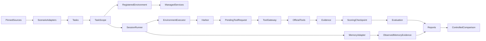

# DuMemEval specification

DuMemEval evaluates agent-controlled memory across isolated execution sessions.
The architecture and extension rules in GOVERNANCE.md remain authoritative.

## Current Architecture

MemoryArena now has five registered dataset adapters/calculators and a managed
environment runtime. A real Harbor/GPT-5.5 Math smoke run completed two sessions,
including official tools, judging and cleanup. The controlled on/off Math run and official asset-dependent scene transport checks
have also completed. Independent acceptance repairs now preserve Search's final
query semantics, durable tool identity and scoring checkpoints. SDK delivery
uncertainty is not automatically replayed. The adversarial checks and independent
re-review pass within the bounded acceptance scope. The upstream baseline has an
unfinished migration from EvalResult to TaskExecution/TaskResult.

## Target Architecture

The existing environment registry owns environment construction. A scoped
SessionExecutor decorator binds one environment to one task and one tool capability
to each session. The session runner remains benchmark-agnostic. Providers with
endpoint-only behavior remain compatible. Managed services are subprocesses with
explicit ownership, readiness, bounded shutdown and source verification.

The agent sees tool schemas and sanitized observations, never environment control
endpoints or initial grading references. A pending tool request is persisted before
delivery and reused after an uncertain response. Scoring checkpoints bind completed
results to the evidence, source and judge configuration; uncertain scoring attempts
require inspection rather than automatic replay. Search judges only the original
final combined query, and a truncated task has no official accuracy.
Official Travel answer feedback is exposed
only when its judgement mode explicitly requests it. Host-owned evidence records task/session/action identity
and is attached before evaluation; runtime errors and absent measurements retain
their own status. Tool request IDs make duplicate delivery detectable. Credentials
are passed in process environment or memory and redacted from exported artifacts.

Official scenario differences live behind the registered provider: WebShop actions,
Travel's Python ToolExecutor, Search's official search/get_document tools, and the
shared Math/Phys environment. Native code execution stays in Harbor's container.
Environment reset happens once per independent task; conversation resets at each
Harbor trial; memory policy alone controls cross-session transfer.

Issue #4 adds scenario-specific task contracts, official scoring evidence,
reproducible environment preparation, and controlled memory-on/off experiments.
Environment, conversation, and memory state have independent lifetimes. Core
execution must not acquire benchmark/backend conditionals. Missing execution or
environment evidence must not be reported as a measured zero or official parity.

Directory memory observations use before/after file hashes and successful structured
ATIF file-read results. File changes are a lower bound on writes, not a count of
all shell operations. Unobserved reads/writes remain null; prompt mentions and
arbitrary shell text are not evidence. The runner only supplies the completed
SessionOutcome through an optional adapter hook; it does not parse runtime traces.

The detailed design and unresolved real-runtime work are recorded in
`docs/datasets/memoryarena.md` and `PLAN.md`. No new memory backend or agent is in scope.
