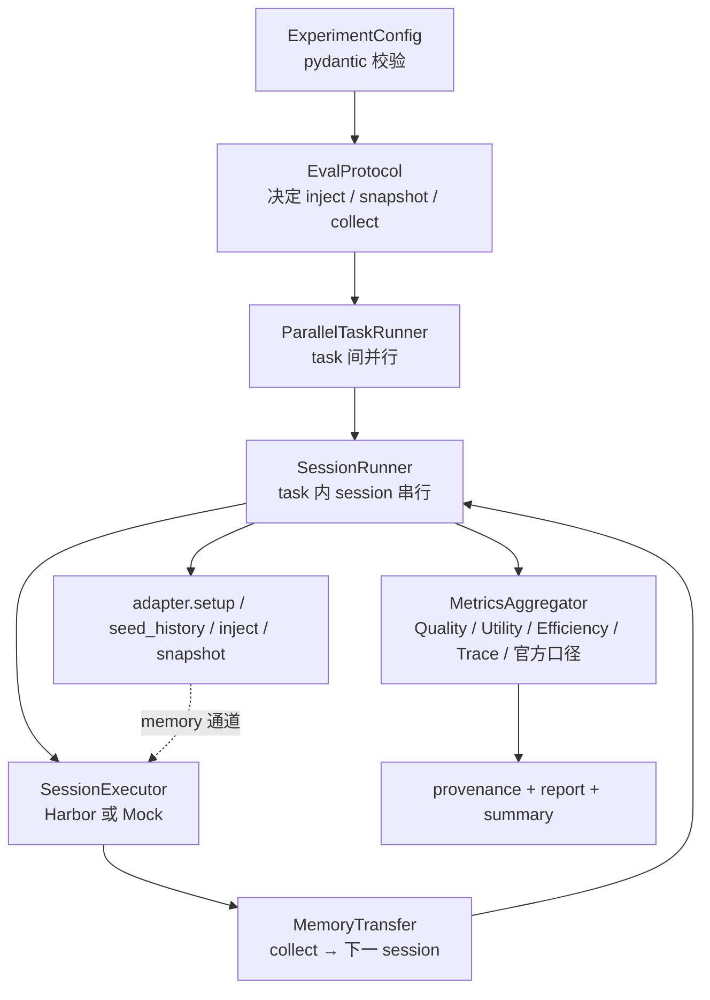
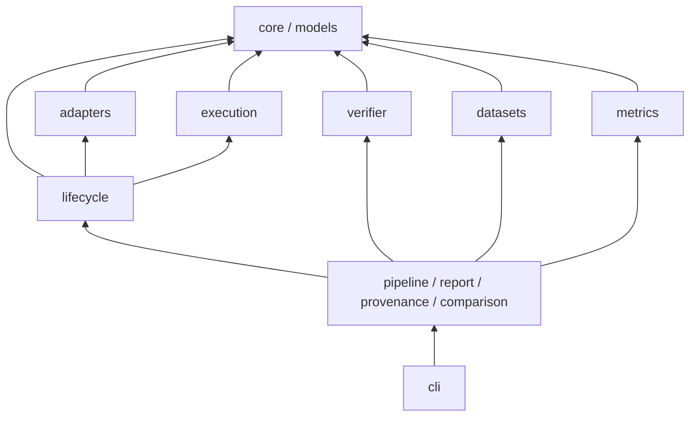

# 分层与扩展点契约

- 状态：implemented
- 源码：全仓库
- 权威禁区清单：仓库根 `GOVERNANCE.md`（本篇是设计说明，冲突时以 GOVERNANCE 为准）

## 评测目标

> 评测「带记忆的 Agent」：在隔离环境里跨 session 地记、取、用；同时报告 Memory 质量、任务效用、系统效率、Agent 行为；官方数据集给出可复现口径。

**不做**：memory API 检索排行榜（那是 adapter 填满后的下游产物）、通用 agent 能力评测（执行引擎可换，但主循环是 memory 生命周期）。判断标准：一个评测问题若不必回答「跨 session 的 memory 演化」，不属于本框架。

## 评测循环

task 内 session **恒串行**：session N 写的记忆要喂给 session N+1，这条链就是被测对象，并行会破坏评测语义。

## 分层

依赖只能向下。四条硬禁区：

| 禁止 | 理由 |
|---|---|
| `execution` → `adapters` | 执行器只负责「在环境里跑 agent」，不感知 memory 产品 |
| `lifecycle` → Harbor 实现类 | 只依赖 `SessionExecutor` 协议，保证引擎可替换 |
| `metrics` → adapters / execution 实现 | 指标层只吃 `EvalResult` / `EvalTask`，保持纯计算 |
| `adapters` → `verifier` | 瞬时重试走 `core.retry`，避免反向依赖 |

## 五个扩展点

| 加什么 | 实现 | 注册 | 文档写到 |
|---|---|---|---|
| memory 后端 | `BaseMemoryAdapter` | `register_adapter` | `docs/adapters/` |
| 评测协议 | `EvalProtocol` | `register_protocol` | `docs/lifecycle/` |
| 数据集 | `BenchmarkAdapter.build_tasks` | `@register_benchmark` | `docs/datasets/` |
| 指标口径 | `MetricCalculator` | `register_calculator` | `docs/metrics/` |
| 任务环境 | `TaskEnvironmentProvider` | `register_task_environment` | `docs/execution/task-environment-layer.md` |

多场景数据集族集中到 `src/dumemeval/benchmarks/<name>/`，内部仍按数据、指标、环境的职责分层，分别接入现有注册表；公共协议留在原通用层。测试和验收材料也按数据集归档，参见 [MemoryArena 目录设计](../datasets/memoryarena/layout.md)。

任务环境既可暴露外部 endpoint（`http` / `webshop`），也可提供受管运行时（`memoryarena`）。准备通过 provider 的 `prepare` 调用；稳定控制输入由 `EnvironmentControls` 提供给报告。行动打分仍走指标层，环境资源与记忆分别管理。

**加能力 = 实现扩展点 + 注册**。禁止在 `SessionRunner.run` 里写 `if backend == ...` / `if benchmark == ...`——那是把可插拔退化成分支树。

## 为什么编排不复用 Harbor Job

Harbor 有 `Job` + `TrialQueue`，我们仍自写 `ParallelTaskRunner`，因为编排单位不同：

- `Job` 要求 trial 配置**预先全部给定**（`_init_trial_configs()` 一次展开）；我们 session N+1 的挂载/env 要等 session N 跑完、`MemoryTransfer.collect` 完成才能构造
- `Job` 无 trial 间**顺序/依赖**语义（`concurrency_group` 只是限流）；我们要「task 间并发、task 内串行」
- `Job` 绑 DB / telemetry / 进度条 / dataset registry，会打穿「Harbor 可选」的边界

## 语义边界

- 「未测」与「测得 0」必须可区分：未实现的指标返回 `None`，报告显示 `n/a`
- mock 模式产出的数字不是实验结果，报告必须带「不可引用」横幅

## 未完成

- 用 `TrialQueue.submit` + `RetryConfig` 替换 `ParallelTaskRunner` 内部队列（需先包一层协议，别把 Harbor 类型引进 `lifecycle`）
- 模块尺寸：超 300 行是拆分信号；当前最大 `adapters/hermes_builtin.py`（314）与 `models/__init__.py`（317）
