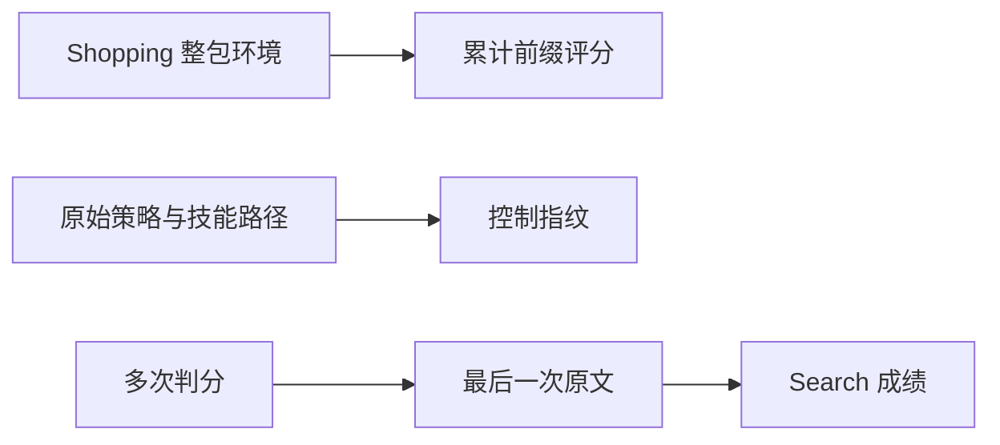
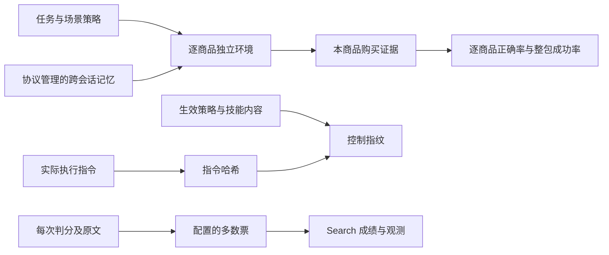

# PR #5 审查反例修复

针对 `abd6346` 的独立审查发现 Shopping 逐商品评分与环境边界、实际提示词和技能指纹、
Search 多次判分聚合三处缺陷。此前“最小验收已完成”的结论由本轮复验结果取代。
本轮不增加全量评测或记忆收益要求，不改写历史模型轨迹。

## 当前架构（Current Architecture）



## 目标架构（Target Architecture）



## 修复边界与验收计划

1. Shopping 对齐官方默认 `split_steps=true`：服务由整个任务持有，每个购买会话建立
   独立官方环境，使用上游 `build_single_step_task`；关闭前一环境后再启动下一环境。
   记忆仍由现有协议跨会话保留。按本商品购买记录评分，整包成功要求所有商品都正确。
   旧的累计轨迹只能在连续购买前缀可对齐时逐轮还原，不把前一轮失败传播给后一轮。
2. 比较指纹区分协议生效后的记忆指令策略，哈希技能目录内的文件内容；执行产物另外
   记录实际指令哈希，以覆盖适配器和运行时追加的指令。只改变挂载且实际提示相同不报警。
3. Search 使用 verifier 的聚合判定；保留每次原始输出、分数及解析观测。
   默认单次判分保持官方口径，配置多次判分时明确标注多数票扩展。

回归至少覆盖：首轮错/未购买而次轮正确、官方逐商品任务构造和汇总对照、
环境关闭与重建且记忆保留、proactive on/off 实际指令与比较警告、相同路径技能内容变更、
相同提示只变挂载、yes/yes/no 与 no/no/yes 及重复判分原文保存。

## 备选方案与否决理由

- 只修 Shopping 布尔比较：不能修复默认逐商品环境边界。
- 只哈希协议名称：会把提示相同的记忆挂载对照也误判为控制变量变化。
- Search 禁止多次判分：会移除已有配置能力；保留聚合并明确观测更符合现有接口。

## 修复结果与反例

| 审查问题 | 当前实现及验证 |
| --- | --- |
| Shopping 前轮失败污染后轮 | 目标 A、B，实际 X、B 或未购买、B，均得 `[false, true]`，逐商品均分 0.5、整包成功率 0。分别直接对照官方 `hydrate_step_summary`、`enrich_task_result`。 |
| Shopping 环境边界 | 使用官方 `build_single_step_task` 和默认 `include_history=false` 构造单商品任务；HTTP 任务构造与官方输出逐字段一致。生命周期回归确认先关闭再初始化，跨商品目录记忆保留。 |
| on/off 提示不同却无警告 | `none` 的两组实际指令相同且不报警；`location`、`proactive` 的实际差异触发警告。另验证运行时追加中文指令后的生成文件字节、会话哈希和最终比较结果一致。 |
| 同路径技能变化 | 改变 `SKILL.md` 内容即可改变控制指纹；配置目录不可观测时明确标记未验证。技能支持文件也参与哈希。 |
| Search 覆盖聚合结果 | `yes/yes/no` 得 accuracy=1、judge_score=2/3；反向 `no/no/yes` 得 accuracy=0、judge_score=1/3。记录三次原文及各次分数；部分调用失败仍为未测，并保留此前观测。 |

首次在 `abd6346` 上运行新反例时，8 项中 7 项失败，只有相同提示的 `none` 对照通过。
最终新增 17 项测试全部通过，包括 13 项审查回归及 4 项官方对照；已有 Harbor 执行测试
也增加了真实生成文件字节与指令哈希的断言。

### 真实 WebShop 工具验收

本轮在固定官方源码和已准备的前 1,000 个商品上，用确定性 HTTP 工具调用完成两次
搜索、点击和购买：首轮故意买错，次轮买对。验证两轮目标分别只有一个商品，
每次 reset 后购买记录为空，环境 ID 不同，initialize/reset/close 各发生两次，清理完成。
实际成绩为逐商品 `[false, true]`、均分 0.5、整包成功率 0。

这是环境和评分的功能固定样例，没有 Agent 模型调用，不能作为模型购买能力或记忆收益结果。
跨会话记忆另由真实 SessionRunner/DirectoryMemoryAdapter 的确定性回归验证，
历史真实 Agent 记忆材料仍对应当时版本。

### 检查与基线

| 检查 | 本轮结果 | 对照 |
| --- | --- | --- |
| 全仓非 e2e | 603 通过、108 失败、13 跳过 | `abd6346` 为 586/108/13；上游 `37a0e19` 为 389/109/13 |
| MemoryArena / 控制变量子集 | 193 通过，无失败或跳过 | 包含 33 项官方源码对照，不重复计数 |
| 完整 mypy | 152 条错误、31 个文件 | 与 `abd6346` 的文件、诊断和出现次数相同；上游为 173 条 |
| 最终回归补跑 | 14 通过 | 13 项新回归及已有 Harbor 指令文件检查 |
| Ruff / 格式 | 全部通过，216 个文件格式通过 | `src/`、`tests/`、Hermes 复现脚本 |
| wheel / sdist | 从源码分发包构建 wheel 成功 | 离线构建；检查新增指令模块已入包 |
| 改动空白 | `git diff --check` 通过 | 不提交本地 SPEC/PLAN |

失败测试按测试身份比较，类型诊断按文件、内容与次数比较，均无新增。
上游对照使用此前在同一环境中验证的固定提交源码及日志，本轮没有重跑上游全仓。
Windows/Harbor 路径差异与旧数据模型迁移失败仍存在，不把完整测试或类型检查标为全绿。

复跑命令（先按[安装说明](memoryarena-clean-setup.md)设置 Python 与官方源码路径）：

```powershell
$arenaTests = @(Get-ChildItem -Path 'tests/test_memoryarena_*.py' | Select-Object -ExpandProperty FullName)
& $python -m pytest @arenaTests tests/test_experiment_controls.py -q
& $python -m pytest tests/ -m 'not e2e'
& $python -m ruff check src/ tests/ configs/memoryarena/hermes_repro.py
& $python -m ruff format --check src/ tests/ configs/memoryarena/hermes_repro.py
& $python -m mypy
```

- [本轮检查与输入文件哈希](memoryarena-review-verification.json)
- [脱敏日志、基线比较和 WebShop 工具证据](memoryarena-review-evidence.zip)

证据包中的 `shopping_episode_probe.py` 接收 `--reference`、`--python`（官方 worker）、
`--assets`（含 `items-first1000-smoke.json` 的商品目录）、`--java-home`、`--output`，
可在完成外部资源准备后复跑。它只测试本地环境，不连接模型服务。
`compare_checks.py --current checks --previous previous --baseline baseline` 可复核包内检查结果。
清单中的源码哈希针对当前改动的 Git blob 字节；旧证据包的历史哈希不变。

## 当前状态

三个已报告缺陷已修复，并通过上述本轮验证。PR 保持草稿，等待复审；
本轮没有调用付费模型，没有执行五场景全量数据，也没有新增记忆收益验收要求。
历史 `memory_instruction: none` Math 对照的实际题面和轨迹保留，不重新计算或改写历史成绩。
