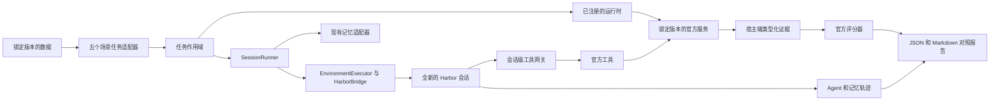
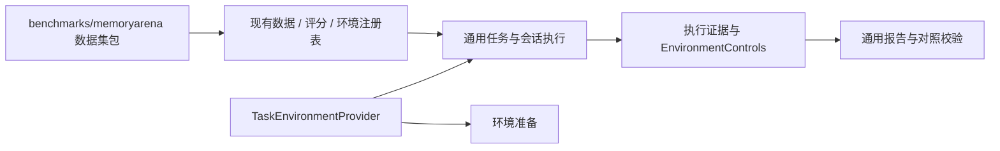

# MemoryArena 接入设计：Issue #4

本地实现与验证记录，更新于 2026-09-16。
代码已集中到 `src/dumemeval/benchmarks/memoryarena/`，测试和本文的验收材料分别集中到对应目录；
目录约定、扩展接口和迁移说明见[目录与扩展边界](layout.md)。
注册与执行沿用原仓库扩展点，最新收敛说明见[原框架复用](framework-reuse.md)。
已提供最小规模的真实运行及官方固定样例证据。PR #5 的独立审查补充了三个反例，
修复及本轮验证见 [审查反例修复](review-fixes.md)，最终验收仍需评审。
验收和复现入口见 [本地验收记录](acceptance.md)。
新增运行时的真实验收与原始材料见 [Hermes 复跑](hermes.md)。
必要指纹缺失的修复与历史报告复核见[控制证据完整性](control-completeness.md)。
本文及配套说明统一使用中文，以保持仓库文档风格一致；命令、API 标识和原始运行证据保留原文。

## 官方来源

- [原始任务](https://github.com/Postroggy/dumemeval/issues/4)。
- [锁定版本的官方代码](https://github.com/ZexueHe/MemoryArena/tree/6cd9de14b71915e39ac742a20dc33785e14b6aab)。
- [锁定版本的官方数据](https://huggingface.co/datasets/ZexueHe/memoryarena/tree/da1a37c8b19280e18627ca01cf368195a5e1d92e)。
- 上述版本未明确代码和数据许可证：代码根目录没有 LICENSE，数据卡没有 license 字段。
  本仓库未直接打包上游代码或资源。
- [来源清单](sources.json) 记录源码及数据指纹。

本任务在五个场景中评测实际使用记忆的 Agent，保留各场景的数据、工具和评分语义。
Mock 运行只验证编排，不能证明记忆收益。

## 当前架构（Current Architecture）

`SessionExecutor.task_scope` 提供可选的任务级资源管理，不向 SessionRunner 引入评测集名称。
EnvironmentExecutor 通过装饰器为执行过程绑定会话工具，运行时由已有环境注册表创建。
四个小型策略分别实现 Shopping、Travel、Search，以及 Math/Phys 共用的语义。
这些策略管理工具和评分参考数据，记忆仍由原有适配器管理。
对上游代码的动态导入限定在独立 worker 内。

## 目标架构（Target Architecture）

目录重构把数据集实现集中存放，环境准备和运行时控制证据通过接口接入。
以上执行链路已有真实最小实验材料；历史运行与本轮结构验证分别记录。

历史校验 JSON 和 ZIP 原样迁移，内部的源码路径、测试名称和哈希属于当时的提交。
复核历史输入请检出各清单标明的提交；当前命令使用新目录，不能把历史清单当作当前代码的重新验收结果。

## 场景契约与官方差异

| 场景 / HF 配置 | 数据与工具 | 评分与边界 |
| --- | --- | --- |
| Shopping / bundled_shopping | 按顺序排列的问题/答案；官方单步任务重建和受管 lite webshop；search/click 动作 | 对齐官方默认 split_steps=true，每商品重建环境；本轮实际购买 ASIN 只与本轮目标比较，前轮错误不影响后轮判分。记忆仍按协议跨轮保留。文本提及不能证明购买，截断 bundle 不报告 overall success。不自行合成属性 judge 的奖励。上游按系统时间初始化的随机性明确标注为未控制。 |
| Travel / group_travel_planner | 基础行程、名称和对齐的轮次 ID；基于官方 CSV 的 ToolExecutor | 保留官方 slot 阈值 0.7 和 hint 阈值 0.9。宿主端提供具名参考答案及 judgement mode，反馈经 submit 返回。重置数据必须与固定版本的数据行一致。派生 slot accuracy 与官方 success 分开报告。 |
| Search / progressive_search | 按顺序排列的上下文子问题，最后为综合问题；基于指定语料/索引的官方 search/get_document 闭包 | 只评分原始最终问题，accuracy 按 query ID 等权聚合。默认单次判分沿用官方解析；配置 num_runs>1 时使用 verifier 多数票，保留逐次原文、分数和解析观测，并标注 majority_vote。截断时官方 accuracy 为未测。不调用上游 step/run_sequential，因为它会在 Harbor 外启动另一套 Agent。提交标注为 agent_submission。不报告 qrel recall；在显式指定的离线缓存中校验 tokenizer 文件及版本。 |
| Math / formal_reasoning_math | 对齐的问题、答案和背景；官方推理工具及 Harbor 原生 Python/Bash | 保留官方等价性判断和 yes 子串解析。最终子问题正确性决定 paper pass rate。Progress 按 paper 等权聚合。逐 k/累计曲线沿用官方分母。原生代码执行证据保留在 Harbor 轨迹中。 |
| Phys / formal_reasoning_phys | 与 Math 共用契约，数据集和任务身份独立 | 共用 MathEnvironment 和评分器，Math 与 Phys 报告分开。 |

适配器拒绝重复 ID、未对齐数组和无效采样。问题文本重复时按会话身份对齐。
每个源数据行对应一个独立任务；一个问题会话中可以执行多次工具动作。

Travel 上游加载器没有 revision 参数。因此 reset 校验会把所选 group 与锁定的 HF 数据行比较，
发现漂移就拒绝运行。包含答案或目标商品的初始观测保留在宿主端。
显式设置 Travel `judgement_mode=answer` 时，提交后按官方语义返回答案反馈。
本框架 off 组的会话彼此隔离，与上游累积历史的基线不同。

## 备选方案与否决理由

| 方案 | 否决理由 |
| --- | --- |
| 为五个场景分别编写执行脚本 | 会重复生命周期和报告逻辑，无法复用统一入口及控制变量检查。 |
| 在 SessionRunner 中按 benchmark 分支 | 会把场景差异带入核心执行链，违背现有注册扩展边界。 |
| 直接调用上游自带的 Agent 主循环 | 会绕过 Harbor 和现有记忆适配器，无法验证本框架的跨会话记忆链路。 |
| 从 Agent 文本推导购买等环境结果 | 缺少真实动作证据，不能保持官方评分语义。 |

## 状态、失败与控制变量

官方服务由整个任务持有。Shopping 环境状态持续一个购买会话，其他场景环境状态持续一个任务；
会话状态持续一次 Harbor trial，记忆遵循已有协议。
失败任务不会被写为已完成检查点，会话挂载和环境变量也不会跨会话累积。

工具客户端脚本以只读方式挂载。会话级工具权限不能重置/关闭环境，也不能选择评分参考答案。
投递 ID 防止动作重复执行；写操作结果不明时，阻止继续写入。
取消操作会等待本次启动过程结束后再清理，确保所有自有服务关闭、子进程回收。

证据区分官方环境响应、官方工具和 Agent 提交。执行错误和原始 judge 观测保持可见。
缺失执行或评分时标为未测，不能记为 0 分。不完整或截断的 paper 不报告官方完整聚合分数。

控制变量指纹覆盖任务内容/ID/指令、协议生效后的 `memory_instruction` 策略、技能目录文件内容、
数据版本、Agent/模型/版本、judge 设置、运行时设置、依赖、源码和外部资源哈希。
会话产物记录实际执行指令的 SHA-256，包含适配器和运行时追加的内容；Harbor 直接哈希
生成的 UTF-8 `instruction.md`。`observed_prompts` 与配置声明分开比较，旧检查点缺少该字段时标记未验证。
实际观测到的 Harbor 模型/版本、官方 worker 版本也与配置声明分开记录。
比较报告会警告控制变量缺失或变化、执行不完整，以及 Shopping 上游随机性。
两组配置均关闭 Claude 原生自动记忆；真实最小运行已检查 Claude 进程中的禁用标志。

Math/Phys 的准备检查根据官方 `env_config.backend` 检查对应 SDK：默认 OpenAI，
OpenRouter 也需要 `openai`，Anthropic 需要 `anthropic`，Gemini/Google 需要 `google.genai`。
检查在实际 worker Python 中生效，缺少命名空间父包也应返回明确的缺依赖报告。
未知后端必须在准备阶段失败；`ready` 不代表模型凭据、Docker 或 API 已通过真实调用。

## 验证结果与范围边界

命令见 [配置与运行说明](../../../configs/memoryarena/README.md)。
校验清单记录检查数量、基线失败和未执行项。
仓库原有的 EvalResult 向 TaskExecution/TaskResult 迁移失败单独报告，未通过改写无关测试掩盖。

本地检查覆盖适配器/CLI 契约、直接调用官方评分器进行比较（包括不同长度的 paper）、
工具权限过期与重复投递、取消顺序、Harbor 只读工具定义绑定、凭据脱敏，
以及使用确定性 judge 固定样例的真实 Math/Phys HTTP 生命周期、工具和评分路由。

历史真实 Math 对照实验使用一条完整的两轮数据。两组均完成 2/2 个会话，
运行时已有的控制变量指纹一致，官方分数均为 1.0，实测分差为 0。
这些运行使用 `memory_instruction: none`，实际题面已有独立核对；
历史产物不能用来声明后来新增的指令哈希字段已经在当时运行中验证。
on 组首轮写入记忆，在全新的第二会话中读取并更新；两组原生自动记忆均关闭。

Travel 的真实 CSV 工具、Shopping 的官方搜索/点击/购买，以及 Search 全语料
BM25/get_document 工具均通过通信固定样例检查，覆盖受管启动、重置和清理。
Shopping 本地通信检查加载前 1,000 个商品；完整资源已下载，但不声称完成全目录评分。
按系统时间初始化的随机性已记录，不用于 Math 对照实验。
Search tokenizer 和全部 100,195 篇索引文档均已锁定。

详见 [验收记录](acceptance.md)、配套校验 JSON 和脱敏证据包。
历史回归及评分一致性检查保留在 [本地验证清单](local-verification.json)；
模型诊断接入过程见 [CLIProxyAPI 联调说明](cliproxyapi.md)。
未运行完整数据集。2026-09-16 已执行完整非 e2e 测试套件并与原仓库基线对照，
历史结果见[提交前修复记录](acceptance-fixes.md#提交前补充修复2026-09-16)，
当前改动的检查结果见[审查反例修复](review-fixes.md)。
