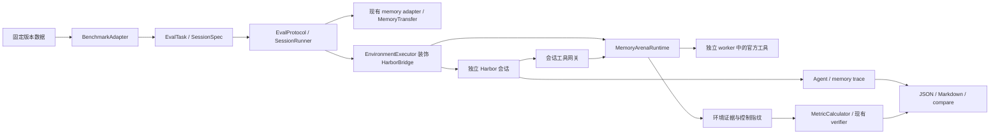

# MemoryArena 五场景接入

本实现对应 [Issue #4](https://github.com/Postroggy/dumemeval/issues/4)。Shopping、Travel、Search、Math、Phys
通过已有评测入口运行，保留各场景的任务组织、工具和官方评分语义。
交付说明按设计、复现、验收三个入口合并，减少逐轮修复记录对评审的干扰。

| 阅读入口 | 内容 |
| --- | --- |
| 本页 | 设计、场景契约、复用边界、备选方案和迁移 |
| [运行指南](clean-setup.md) | 固定版本安装、五场景准备、真实 on/off、检查命令和故障排查 |
| [验收报告](acceptance.md) | 15 条验收标准、结果、原始证据与验证限制 |

## 官方来源

调研日期为 2026-09-14。官方源码固定在
[`6cd9de1`](https://github.com/ZexueHe/MemoryArena/tree/6cd9de14b71915e39ac742a20dc33785e14b6aab)，
HF 数据固定在
[`da1a37c`](https://huggingface.co/datasets/ZexueHe/memoryarena/tree/da1a37c8b19280e18627ca01cf368195a5e1d92e)，使用 `test` split。
[sources.json](sources.json) 记录实际阅读的 runner/setup/环境/评分文件、文件哈希、数据和外部资源版本。
该版本的官方代码根目录没有 LICENSE，数据卡没有 license 字段，因此记录为未明确；不推定许可，也不将上游源码或大型资源打包进本仓库。

## 架构与复用边界

| 边界 | 复用与必要扩展 |
| --- | --- |
| 数据 | `BenchmarkAdapter` + `@register_benchmark`；通用数据注册表与上游基线一致。 |
| 评分 | `MetricCalculator` + `register_calculator`；可选 `aggregate()` 支持 paper/query 口径。 |
| 环境 | `TaskEnvironmentProvider` + `@register_task_environment`；补充 `prepare`、`create_runtime` 和任务/会话生命周期。 |
| 执行与记忆 | 复用 `EvalProtocol`、`SessionRunner`、`SessionExecutor`、Harbor 和 memory adapter；通过 `task_scope` 与执行器装饰器绑定受管环境。 |
| 控制证据 | provider 声明 `observed_control_keys`，运行时提供 `EnvironmentControls`；通用报告读取类型化结果。 |
| 模型判分 | 复用 verifier 的调用、解析和多次判分；评分检查点防止恢复时重复判分。 |

集成代码集中在 `src/dumemeval/benchmarks/memoryarena/{datasets,metrics,environment}/`；
通用协议、工具网关、Agent 工具客户端保留在 `task_environments/`。
包初始化沿用已有注册入口；查询函数只查注册表。包导入不启动服务或提前加载可选 SDK。
核心主循环没有按 MemoryArena 场景名称增加分支，四个场景策略承接差异，Math/Phys 共用推理策略。

## 五场景契约与官方差异

每个源数据行生成一个任务，行内问题按官方次序生成会话；一个会话可调用多次工具。
适配器校验 ID、数组对齐和采样参数，问题文本重复时仍按会话身份对齐。

| 场景 / HF 配置 | 数据、交互与任务组织 | 官方评分和差异 |
| --- | --- | --- |
| Shopping / `bundled_shopping` | 顺序问题/答案、商品库、lite webshop 的 search/click/购买；默认 `split_steps=true`，每商品重建环境，记忆按协议保留。 | 宿主实际购买 ASIN 与本轮目标比较；前轮买错不影响后轮。完整 bundle 才报告 overall success；没有购买证据为未测，不从文本提及推断购买。上游按系统时间初始化的随机性未控制。 |
| Travel / `group_travel_planner` | 基础行程、名称、轮次 ID 和官方 CSV `ToolExecutor`；提交返回官方反馈。 | 保留 slot 阈值 0.7、hint 阈值 0.9 和 judgement mode。派生 slot accuracy 与 success 分开。官方加载器不支持 revision，reset 后与锁定数据行比较，漂移则拒绝运行。 |
| Search / `progressive_search` | 顺序上下文子问题和最终综合问题；官方 search/get_document，支持固定 BM25 或匹配的稠密索引。 | 仅判原始最终问题，按 query ID 等权聚合；截断时 accuracy 未测。默认单次 judge 保留官方解析，多次 judge 是显式多数票扩展，保留各次原文和通过比例。不调用会自行启动另一 Agent 的上游主循环；不报告 qrel recall。 |
| Math / `formal_reasoning_math` | 对齐的问题、答案、背景；官方 reasoning 工具与 Harbor 原生 Python/Bash。 | 保留官方等价性判断与 yes 子串解析；最终子问题决定 paper pass rate，progress 按 paper 等权聚合，曲线沿用官方分母。标准答案留在宿主评分侧。 |
| Phys / `formal_reasoning_phys` | 共用官方 MathEnvironment 与推理评分逻辑，数据和任务身份独立。 | 与 Math 分开报告。 |

Travel 的隔离会话 off 基线与官方累积对话历史的基线不同，`judgement_mode=answer` 时提交后的答案反馈按官方语义返回。
Search tokenizer 固定版本及离线缓存；Shopping 的官方依赖存在冲突，独立 worker 使用已记录的兼容锁定清单，详见运行指南。

## 状态、重试和评分边界

| 状态 | 生命周期 |
| --- | --- |
| 环境 | prepare 检查版本/资源/SDK；任务作用域启动并等待 readiness，初始化/reset，结束时关闭自有服务；Shopping 额外按商品会话重建。 |
| 对话 | 每个 Harbor trial 使用新会话；工具权限限定到当前会话，Agent 无权 reset/关闭服务或选择评分参考答案。 |
| 记忆 | 现有协议决定注入、收集、快照和跨 session 传递；新执行尝试隔离临时传递目录，失败内容不会自动进入新尝试。 |

会话工具请求使用持久化投递 ID；相同请求重试取回缓存结果，结果不明的写入阻止继续重放。
取消时等待自有启动操作结束再清理。失败执行不保存为成功检查点。
评分检查点的身份包含证据、judge/数据配置和评分源码；完成结果可复用，未完成或损坏的尝试停止并保留诊断。
框架 judge 与官方 Math/Phys worker 关闭 SDK 自动重试，外部代理也需按运行指南关闭隐式重发。

官方 score、场景结果、judge/verifier 原文与判定、derived metrics、execution status 分别保存。
执行失败、跳过或没有评分证据为未测，不写成 0 分；截断 paper/bundle 不报告完整任务成功率。
目录记忆的文件变化与可识别结构化读取是观测下界；Hermes 读取通过原生 `read_file` 与快照核验。

## 受控实验

指纹覆盖任务/样本、数据版本、Agent/模型、judge、runtime、环境、代码、实际记忆指令和 Skill 内容。
实际生成的 UTF-8 任务指令另记录 `observed_prompts`，环境的稳定输入与端口/PID 等瞬时值分开。
缺失、空或不完整证据标记未验证，未控制的环境因素产生警告。
Search 多次 judge 记录多数票结果及各次原文，不能用最后一次回答代替聚合。

`controlled-math*.yaml` 使用相同完整两轮样本、`memory_instruction: none` 和镜像内共用 Skill，
只切换记忆可用性与传递协议。通用场景模板还会改变记忆提示后缀，不能直接视作同一严格对照。
旧报告缺少后来新增的控制字段时保持原始字节与分数，当前比较器会明确报警；历史实验边界见验收报告。

## 兼容与迁移

注册名称、别名、CLI/YAML、顶层 `dumemeval.metrics` 计算器和 `dumemeval.environments.WebshopTaskEnvironment` 保持兼容。
用户注册覆盖和直接导入子模块有回归检查。内部路径迁移如下；旧证据内的路径/哈希属于其记录版本。

| 原内部路径 | 当前路径 |
| --- | --- |
| `datasets/benchmarks/memoryarena_<scene>.py` | `benchmarks/memoryarena/datasets/<scene>.py`（Math/Phys 共用 `reasoning.py`） |
| `metrics/benchmarks/memoryarena*.py` | `benchmarks/memoryarena/metrics/`（原 `memoryarena.py` 为 `travel.py`） |
| `task_environments/` 中的 MemoryArena 专属实现 | `benchmarks/memoryarena/environment/` |
| 通用准备入口 | `task_environments.prepare.prepare_environment` 保留，按 provider 能力分派。 |

## 备选方案与取舍

| 方案 | 取舍 |
| --- | --- |
| 为五场景各写 runner | 重复生命周期、记忆与报告；采用通用 runner 加场景策略。 |
| 在核心主循环按数据集分支 | 集成语义进入公共层；采用原有注册表和执行器装饰器。 |
| 直接使用官方 Agent 主循环 | 会绕过 Harbor 与被测 memory adapter；复用官方环境和评分。 |
| 新建插件发现、通用 judge 框架 | 本任务没有需要；沿用注册函数、包初始化和 verifier。 |
| 从 Agent 文本判断购买 | 不能证明动作发生；采用宿主环境证据。 |
| 将所有旧数据集一并迁移 | 超出本次集成范围，只集中 MemoryArena 自有实现。 |
