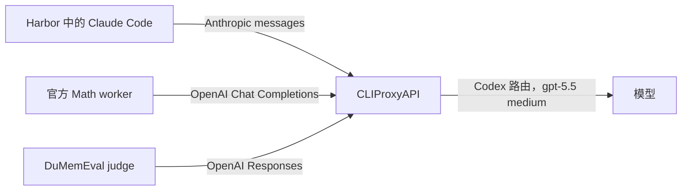

# CLIProxyAPI 模型联调说明

2026-09-15 的本地联调使用现有 Harbor Claude Code Agent，
通过 CLIProxyAPI 的 Codex 路由调用 gpt-5.5。
Agent 与模型是独立组件：原生执行程序仍为 Claude Code 2.1.89，
模型请求使用 gpt-5.5，推理强度为 medium。

## 固定版本

- CLIProxyAPI：[v7.3.2](https://github.com/router-for-me/CLIProxyAPI/releases/tag/v7.3.2)，
  提交 7fa443dc8bf8ca2f1ffd81c2472deb31b097b697，MIT 许可证。
- Windows amd64 发布压缩包的 SHA-256：
  a07ada91dcd83f24e491c78ad543a9d08d36d2472408194b21cf9d0a46eb4be1。
  执行前已对照发布版 checksums.txt 校验。
- 模型请求：gpt-5.5(medium)。代理的后缀处理及 Codex payload 覆盖均指定
  reasoning.effort=medium。上游响应报告 gpt-5.5；未配置模型别名或后备模型。
- [OpenAI 模型说明](https://developers.openai.com/api/docs/models/gpt-5.5)
  说明了该模型及 medium 推理设置。代理的 Codex 路由使用账号认证，
  本实验没有直接使用 OpenAI API key 调用模型。

## 运行边界



代理监听 127.0.0.1:8317，使用生成的客户端密钥。
Docker Desktop 通过 host.docker.internal:8317 访问；宿主 worker 和框架 judge 使用 127.0.0.1。
这些地址均为显式配置，执行层或评测集层不会改写地址。
本地实验关闭管理路由、插件和请求正文日志。

凭据及配置文件位于仓库外，只允许当前 Windows 用户和 SYSTEM 访问。
历史联调仅复制当时有效的 Codex access token，未修改原认证文件和 refresh token。
该 access token 于 2026-09-19 到期。这是临时联调服务，不是无人值守的 token 刷新部署。
客户端密钥和认证文件不得提交到仓库。

## 已完成的最小验证

用户要求证明联调能跑通，不运行完整数据集或重复完整测试套件。
下方两个诊断运行均以退出码 0 结束。

| 诊断项 | 实际观测 |
| --- | --- |
| 固定 Math 数据行的前两个问题 | 两个 Harbor 会话均无异常完成。官方推理工具和两次提交返回关联证据；judge 观测分别为 no、yes。 |
| 合成记忆探针，两个全新会话 | 会话 1 用 Python 生成 UUID 并存入 /app/memory。会话 2 读出完全相同的 UUID，其提示词不含该 UUID。两次快照和持久文件内容一致。 |
| 原生记忆控制 | 实际 Claude 进程中包含 CLAUDE_CODE_DISABLE_AUTO_MEMORY=1 和 CLAUDE_CONFIG_DIR=/logs/agent/sessions。 |
| 清理 | 官方环境已关闭，worker 已回收，全部诊断 trial 容器已移除。 |

Math Agent 检查了记忆目录，但自主选择不保存文件。
单独的合成探针在不改变评测提示词的前提下，验证同一个目录适配器和 Harbor 挂载机制。
它是合成通信检查，不用于测量记忆收益。该 Math 诊断是截断结果，
不报告完整 paper 分数，也不构成 memory-on/off 对照实验。

仓库根目录下的结果路径：

- results/memoryarena/cliproxy-minimal-openai-20260915
- results/memoryarena/cliproxy-memory-canary-20260915

每个目录包含原生轨迹、逐任务 JSON/Markdown 报告、快照和运行汇总。
Math 运行还包含宿主端环境证据及 native-environment.json。
cliproxy-verification.json 记录断言和产物哈希。
Windows 上终止自有 worker 时记录退出码 1；独立的 cleanup_status 为 completed，进程已回收。

## 兼容性修复与探测

- 模型目录包含 gpt-5.5。
- Anthropic 兼容请求返回 PROXY_OK，响应模型为 gpt-5.5。
- 一次真实 tool_use/tool_result 往返返回 PROXY_TOOL_OK。
- Docker 容器可以访问代理，未认证请求正确返回 HTTP 401。
- 框架 OpenAI judge 最初丢失了响应文本。Responses message 项在 content 中包含
  output_text 块，没有 message.text 字段。客户端现使用 SDK output_text 访问器，
  保留答案块，排除推理摘要和拒绝内容。两个协议结构回归用例与 24 个原有 verifier 测试通过，
  真实请求返回 PROXY_JUDGE_OK。
- 官方 Anthropic 后端假设 response.content[0] 是文本，Codex 推理却可能生成 ThinkingBlock，
  关闭摘要时还可能返回仅含签名的块。最终诊断配置选用官方 OpenAI 后端，
  其现有 Chat Completions 解析器直接读取答案字段。
  直接调用官方后端的探测及真实 Math 运行均通过，当时无需修改上游源码、
  对 SDK 打猴子补丁或修改代理代码。
- 首次 Harbor 冷启动在安装 Agent 依赖时被取消。
  将校验过的 Claude 原生二进制放入本地镜像后，无需在 trial 内重复安装。
  Harbor 确认要求的 2.1.89 版本已安装。

被取消的冷安装和失败的 Anthropic 后端尝试都是诊断产物，不是对照组。
最终代理配置只覆盖 reasoning.effort=medium，实验性的摘要过滤已移除。
验收状态与验证边界统一见随 Issue 交付的[验收记录](acceptance.md)和
[修复复验说明](acceptance-fixes.md)，便于直接从仓库核对最终结果。

## 复现最小诊断运行

新机器按 [从全新检出目录开始安装](clean-setup.md) 操作，
其中包含下载、校验、隔离依赖环境、运行者登录、代理就绪检查、原生镜像构建和官方环境准备。
下方命令仅保留历史机器上的诊断操作步骤。

真实 Math 诊断使用 configs/memoryarena/cliproxyapi-smoke.yaml，
合成记忆探针使用 configs/memoryarena/cliproxyapi-memory-smoke.yaml。
前置条件是仓库锁定的 Harbor/judge/memoryarena 依赖、固定版本的官方检出目录、
运行中的本地代理和预先构建的 Agent 镜像。已有本地安装可直接使用，无需完整测试运行。

从仓库根目录执行 PowerShell，使用本机已有的私有代理：

```powershell
$env:MEMORYARENA_REFERENCE = 'E:\tmp\memoryarena-issue4-ref'
$env:MEMORYARENA_PYTHON = (Resolve-Path .venv\Scripts\python.exe).Path
$env:MEMORYARENA_SMOKE_RUN = 'cliproxy-smoke-' + (Get-Date -Format 'yyyyMMdd-HHmmss')
$env:MEMORYARENA_CANARY_RUN = $env:MEMORYARENA_SMOKE_RUN + '-memory'
$proxyKeyFile = Join-Path $env:LOCALAPPDATA 'DuMemEval\cliproxyapi-7.3.2\client-key.txt'
$env:DUMEMEVAL_PROXY_KEY = (Get-Content -LiteralPath $proxyKeyFile -Raw).Trim()
$env:ANTHROPIC_AUTH_TOKEN = $env:DUMEMEVAL_PROXY_KEY
$env:ANTHROPIC_BASE_URL = 'http://host.docker.internal:8317'
.venv\Scripts\python.exe -m dumemeval run --config configs/memoryarena/cliproxyapi-smoke.yaml --no-resume
.venv\Scripts\python.exe -m dumemeval run --config configs/memoryarena/cliproxyapi-memory-smoke.yaml --no-resume
```

MEMORYARENA_SMOKE_IMAGE 可选择其他已准备好的镜像。
使用新的运行 ID 将诊断分开存放。已执行的运行保留解析后的配置；
可复用 YAML 模板通过环境变量指定路径和运行 ID。

### 已准备的 Agent 镜像

镜像为 dumemeval-claude:2.1.89-smoke-20260915。
原生 linux-x64 二进制的 SHA-256 为
903cb3c96b314d86856632c8702f5cdf971b804d0b19ef87446573bcd1d7df1c，
已对照 [官方版本清单](https://downloads.claude.ai/claude-code-releases/2.1.89/manifest.json) 校验。
[二进制下载](https://downloads.claude.ai/claude-code-releases/2.1.89/linux-x64/claude)
属于外部构建输入，不直接打包到本仓库。

将验证后的二进制命名为 claude，放入构建上下文后使用：

```dockerfile
FROM python:3.13-slim@sha256:9d2e5553305c7c7b0097999bb17187c69b921ccd6bc9d40e4bb5ebe652c00285
WORKDIR /workspace
COPY claude /usr/local/bin/claude
RUN chmod 755 /usr/local/bin/claude && claude --version
```

已验证构建所用的本地上下文为 `E:\tmp\dumemeval-cliproxy-smoke\agent-image`。
这是可选诊断镜像，项目标准 Docker 和发布流程未变。

## 后续完整对照实验

后续完整两轮 on/off 实验、固定共用 Skill、外部资源场景检查和复现命令见
[本地验收记录](acceptance.md)。
上方历史最小运行及合成记忆探针产物继续作为诊断记录保留。
它们原先缺失的记忆计数已通过单独的原始证据重新分析补充。
