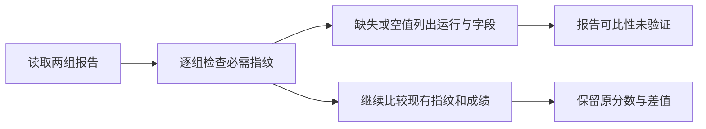

# PR #5 补充修复：控制指纹完整性

本页的结果和证据包对应 `8811040`；包内脚本保留当时的模块及归档路径，应在该提交检出目录中使用。
当前目录下的完整复验入口见[目录重构验证](layout.md#验证结果)。

针对 `3f6dd63` 的复审发现：历史 Hermes on/off 都缺少 `observed_prompts` 和
`agent_skills` 时，比较器只比较现有字段，错误返回零警告。
历史分数没有因此被判错；问题在于报告没有说明可比性尚未验证。

## 当前架构（Current Architecture）


## 目标架构（Target Architecture）



## 规则与实现边界

所有运行的最低必需字段为 `tasks`、`dataset`、`agent`、`agent_skills`、`judge`、
`runtime`、`task_environment`、`code`、`observed_prompts`。
字段不存在、空字符串或只有空白时，报告对应运行与字段，并标记 `unverified`。
现有 `not-observed`、`not-controlled`、配置差异和执行不完整的警告继续生效。
场景额外观测字段的检查规则保持原有范围。

没有配置技能目录时，新报告仍会记录空技能集合的哈希；因此“不使用 Skill”与
“历史记录没有技能证据”可以区分。只有静态配置指纹、没有实际指令观测的记录也应报警。
比较器保留旧报告读取能力，不补造缺失哈希、不重写历史报告、不改变成绩。

## 备选方案

- 仅检查两组字段并集：两边同时缺失时仍会遗漏。
- 给旧报告补上默认哈希：会把未观测伪装为已验证。
- 拒绝读取旧报告：妨碍查看历史成绩；明确警告足以表达限制。

## 验收计划

回归覆盖单边/双边缺少新字段、空值、显式未观测、仅保留新字段却缺少旧必需字段、
完整匹配记录，以及直接读取已提交的 Hermes Math 和记忆诊断 on/off 归档。
历史归档用例同时检查 JSON/Markdown 输出含警告、成绩与差值保持原值。

## 验证结果

新增 10 项回归首次在 `3f6dd63` 上运行时，9 项失败，只有显式 `not-observed` 用例通过。
修复后 10 项全部通过；连同控制变量、上轮审查反例和比较警告测试，定向检查共 32 项通过。
完整且一致的 9 项指纹以及实际捕获相同提示的 on/off 对照均不会产生新警告。

直接读取已提交的历史 Hermes 归档，Math 和记忆诊断两组现在均报告：

```text
Required control fingerprints are missing for off: agent_skills, observed_prompts; experiment comparability is unverified
Required control fingerprints are missing for on: agent_skills, observed_prompts; experiment comparability is unverified
```

JSON 和 Markdown 均包含上述警告；Math 的全部数值比较与归档结果完全一致，
归档 SHA-256 及输入文件字节不变。回归检查也验证两个场景的原分数和差值不变。

| 检查 | 本轮 | 上一提交 `3f6dd63` |
| --- | --- | --- |
| 全仓非 e2e | 613 通过、108 失败、13 跳过 | 603 通过、108 失败、13 跳过 |
| MemoryArena / 控制变量 / 新完整性回归 | 203 通过，无失败或跳过 | 193 通过 |
| 其中官方源码对照 | 33 通过 | 33 通过 |
| 完整 mypy | 152 条错误、31 个文件 | 相同文件、诊断与出现次数 |
| Ruff / 格式 | 通过，217 个文件格式通过 | — |
| 改动空白 | `git diff --check` 通过 | — |

失败测试按身份与 `3f6dd63` 及上游 `37a0e19` 的已归档结果比较，无新增失败；
类型诊断也没有新增。上游归档仍为 389 通过、109 失败、13 跳过及 173 条类型错误，
本轮没有重跑上游基线。没有重新调用真实 Agent 或付费模型。

检查命令（`$python` 与 `MEMORYARENA_REFERENCE` 沿用[安装说明](clean-setup.md)）：

```powershell
& $python -m pytest tests/test_control_completeness.py tests/test_experiment_controls.py tests/benchmarks/memoryarena/test_historical_controls.py tests/benchmarks/memoryarena/test_review_regressions.py tests/test_comparison.py::TestComparabilityWarnings -q
& $python -m pytest tests/ -m 'not e2e'
& $python -m ruff check src/ tests/ configs/memoryarena/hermes_repro.py
& $python -m ruff format --check src/ tests/ configs/memoryarena/hermes_repro.py
& $python -m mypy
```

- [本轮检查清单与输入哈希](control-completeness-verification.json)
- [回归日志、Hermes 重新比较结果及复核脚本](control-completeness-evidence.zip)

证据包包含 `recheck_hermes.py --repo <仓库> --output <新输出目录>`，只读取已提交归档并重新比较；
`verify_checks.py --repo <仓库> --checks <解压目录>/checks` 则逐项对照当前日志与上轮归档。
上轮 27 个输入文件的哈希仍对应 `3f6dd63`，新清单记录本次改动，旧运行证据不作补写。

本次遗漏已修复并完成本地复验。PR 保持草稿；推送前查询仍无 GitHub 复审记录或 CI 检查结果，
本地检查不替代外部复审。不新增全量评测或正记忆收益要求。
