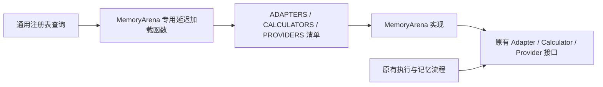
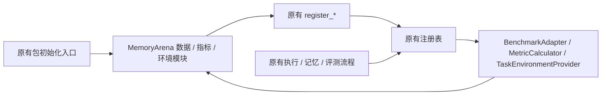

# MemoryArena 复用原框架的接入边界

2026-09-16。MemoryArena 是一个数据集集成；以 PR 的上游基线 `37a0e19` 中已有的
扩展点为基础。数据集专属目录继续保留，注册方式遵循原框架。

## 调整前（Current Architecture at `3426ddd`）



目录集中以后，三个注册表又分别承担了加载具体集成的职责。现有 `register_*`
已经能表达注册和别名，没有必要为同一个数据集维护另一组组件清单与加载分支。

## 目标结构（Target Architecture）



## 实现范围

- 数据适配器复用 `@register_benchmark`，指标和环境复用 `register_calculator`、
  `register_task_environment`。内置包在原有初始化位置导入集成；查询函数只查询注册表。
- MemoryArena 代码继续集中在 `benchmarks/memoryarena/`。注册名称、别名、CLI/YAML
  和已有顶层导出保持兼容；直接导入集成子模块也能正确完成注册。
- 继续复用 `SessionExecutor`、`SessionRunner`、`EvalProtocol`、memory adapter 和
  verifier。模型调用、重试、多次判分共用既有实现。
- 保留真实环境所需的最小补充：provider 准备与 runtime 生命周期、环境控制证据、
  calculator 的官方聚合钩子。这些能力已有独立 provider 和官方对照测试。
- 已修复的 Shopping 逐商品评分、Search 多数票和缺失控制证据语义保持不变。

## 取舍

| 方案 | 判断 |
| --- | --- |
| 复用已有注册函数和包初始化 | 采用；与仓库其他数据集一致，减少通用查询代码中的具体集成知识。 |
| 新建集成描述模型或插件发现系统 | 本次接入没有这种需求，继续使用原有三个职责独立的注册表。 |
| 重写通用 judge 策略系统 | 属于独立框架改进，本次保持现有 verifier 接口。 |
| 将全部旧数据集搬到新目录 | 超出本次 MemoryArena 接入范围。 |

## 验证计划

1. 在新进程中验证直接导入、原有注册名称、别名和用户覆盖；阻止提前加载可选 SDK。
2. 复跑 MemoryArena、环境扩展、控制证据、评分缓存与官方源码对照测试。
3. 检查 Ruff、格式、mypy 和非 e2e 套件；与父提交已有失败逐项对照。
4. 构建 wheel/sdist，在仓库外检查安装产物的注册与入口。

## 验证结果

目标结构已实现。`datasets/benchmark.py` 与上游 `37a0e19` 完全一致，数据和指标
注册表的查询函数均不再加载 MemoryArena；具体组件通过原有注册函数接入。
本轮仅调整注册与导入，没有改变评分算法、环境生命周期或模型调用。

2026-09-16，Windows / Python 3.12.11：

| 检查 | 结果 |
| --- | --- |
| 全仓非 e2e | 632 通过、108 既有失败、13 跳过；失败测试身份与父提交完全一致。 |
| 相关子集 | 232 通过，包含 33 项官方源码对照。 |
| mypy | 152 条错误、31 个文件；诊断与父提交逐项一致。 |
| Ruff / 格式 | 通过，229 个 Python 文件格式检查通过。 |
| wheel / sdist | 构建通过；wheel 中 154 个源码模块与工作区一致。 |
| 安装产物 | 仓库外 8 项导入/注册检查、Agent 客户端入口、真实官方 Math worker 生命周期均通过。 |
| 历史材料 | 17 个既有 JSON/ZIP 与父提交一致；ZIP 比较原始字节，JSON 归一化 Git 换行。 |

通过数增加 3，来自公共数据、指标、环境入口的独立导入顺序测试；没有删除失败测试。
本轮没有调用付费模型。已有真实 Hermes on/off 材料保持历史证据身份。

[校验清单与改动源码哈希](framework-reuse-verification.json) 和
[检查日志及复核脚本](framework-reuse-evidence.zip) 记录本轮结果。
将归档解压到 `.cache/pr5-reuse-20260916/`，按[安装说明](clean-setup.md)设置 Python
和 `MEMORYARENA_REFERENCE` 后，可从仓库根目录复跑：

```powershell
& $python -m pytest tests -m 'not e2e' -q --junitxml=.cache/pr5-reuse-20260916/pytest-current.xml
& $python -m mypy src tests --no-incremental
& $python -m ruff check src tests
& $python -m ruff format --check src tests
uv build --python $python --out-dir .cache/pr5-reuse-20260916/dist
& $python .cache/pr5-reuse-20260916/check_delivery.py
& $python .cache/pr5-reuse-20260916/summarize_checks.py
```

`summarize_checks.py` 核对归档的测试/类型检查日志、源码哈希和安装验证结果；
它本身不会重新执行 pytest/mypy。重跑时将各命令输出保存到归档中的同名日志。
本地检查不替代维护者复审或 GitHub CI；SPEC/PLAN 不在 PR 中。
