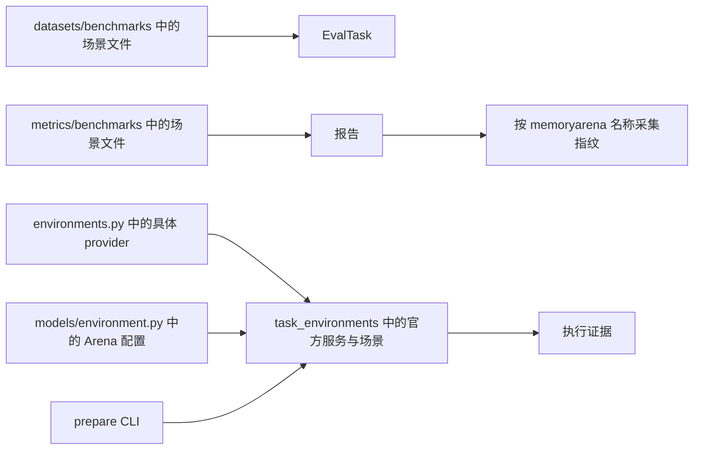
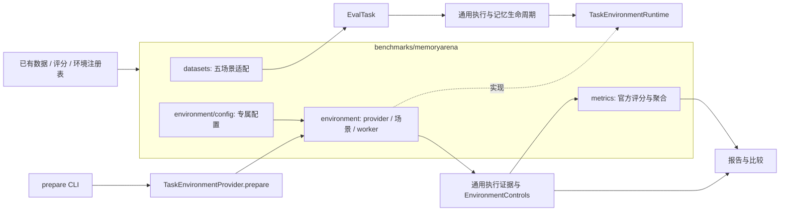

# MemoryArena 目录与扩展边界

2026-09-16，PR #5 的目录重构设计。后续会接入更多数据集，因此将一个数据集族的实现按归属集中存放，通用层保留协议、注册和编排。

本文验证结果和归档对应 `3426ddd`。后续注册方式已收敛为原有 `register_*` 与包初始化，
最新设计和复验见[原框架复用](framework-reuse.md)；历史归档脚本应在其对应提交运行。

## 重构前（Current Architecture）



问题是同一集成横跨多个平铺目录，环境准备直接调用具体实现，通用溯源代码也知道该数据集的字段和随机性策略。继续照此接入会增加核心层分支。

## 目标（Target Architecture）



目录约定：

```text
src/dumemeval/benchmarks/memoryarena/
  datasets/       # 数据类型、校验和五场景任务适配
  metrics/        # Shopping / Travel / Search / Math / Phys 评分与聚合
  environment/   # 配置、provider、准备、HTTP client、worker、场景与运行时
tests/benchmarks/memoryarena/
  fixtures/      # 固定输入和来源
  test_*.py      # 契约、官方对照、运行时与历史报告回归
docs/datasets/memoryarena/
  README.md      # 接入设计与验收索引
  *.md           # 各轮修复和复现说明
  *.json, *.zip  # 原始校验清单与脱敏证据
configs/memoryarena/  # 已集中存放，继续使用现有命令和 YAML
```

## 接口与兼容

- 数据、评分和环境通过既有 `register_*` 注册，由包初始化导入集成；注册名称与 CLI/YAML 保持兼容。注册后的用户覆盖不能被后续查询重置，直接导入子模块也必须可用。
- `TaskEnvironmentProvider.prepare` 返回通用准备结果；MemoryArena 的结果子类保留 revision、scene、sources 和 assets。没有受管准备能力的 provider 明确报错。
- provider 通过 `observed_control_keys` 声明必须观测的控制项。`EnvironmentControls` 只包含稳定指纹输入和未控制的因素，由各运行时选择字段；通用报告不解释官方服务字段、场景名或随机性策略。
- 缺失、空或不完整的运行时控制证据仍为 `not-observed`。旧报告和证据归档保留原始字节；不回填当时未采集的字段，也不改变旧分数。
- 比较警告按状态列出对应运行和控制字段，避免把其他 provider 的未控制因素统一称作上游随机性。
- 任务环境通用协议、工具网关和无依赖的 Agent 工具客户端继续放在 `task_environments/`；它们可供其他环境复用。LLM 传输、重试、共享输出格式解析和通用指标仍留在原层。
- 评分检查点将新的 `benchmarks/` 目录计入源码指纹；修改数据集评分代码必须使旧缓存失效。
- 顶层 `dumemeval.metrics` 导出的 MemoryArena 计算器和 `dumemeval.environments.WebshopTaskEnvironment` 保留。内部模块路径迁移见 CHANGELOG；历史 JSON 内的路径与哈希属于原提交，不作改写。

## 备选方案与否决理由

| 方案 | 取舍 |
| --- | --- |
| 每个通用层下分别新增 memoryarena 子目录 | 能减轻平铺，但新增一个场景仍需在多处寻找归属；采用数据集族统一目录。 |
| 连同通用执行、记忆和工具网关一起搬入集成包 | 会重复通用生命周期并限制复用；只移动该集成拥有的实现。 |
| 引入新的插件发现系统 | 当前已有注册表和包初始化方式足够；具体接入见[原框架复用](framework-reuse.md)。 |
| 为每个旧内部文件留下转发文件 | 会保留原来的平铺噪声；仅保留明确的顶层公开导出。 |

## 验证计划

1. 复跑现有 MemoryArena、控制变量及官方源码对照测试。
2. 用另一个 provider 验证准备路由和控制证据，覆盖缺失证据、瞬时端口变化和稳定资源变化。
3. 在新进程中检查导入顺序、注册和自定义覆盖；验证评分实现变化会使缓存失效。
4. 构建 wheel/sdist，从安装产物检查五场景入口及独立 worker/client 脚本。
5. 运行非 e2e 套件、Ruff、mypy，并与上一提交的既有失败逐项比较。
6. 检查文档链接、历史归档字节、迁移路径及中文 PR 描述。

## 验证结果

2026-09-16，Windows / Python 3.12.11。相对父提交 `8811040` 完成目录重构和接口抽取。

| 检查 | 结果 |
| --- | --- |
| 全仓非 e2e | 629 通过、108 既有失败、13 跳过；失败测试身份与父提交完全一致。 |
| 相关子集 | 229 通过，包含 MemoryArena、环境扩展、控制指纹和评分检查点。 |
| 官方源码对照 | 33 通过，属于上面的子集。 |
| mypy | 152 条错误、31 个文件；文件、诊断和出现次数与父提交一致，相对上游无新增。 |
| Ruff / 格式 | 通过；229 个 Python 文件格式检查通过。 |
| wheel / sdist | 构建通过，24 个集成源码模块在安装包中核对一致。 |
| 安装产物 | 在仓库外执行 5 项导入/注册检查、Agent 客户端入口，以及真实官方 Math worker 的启动、reset、step、tools、close；均通过，未调用模型。 |
| 历史材料 | 16 个迁移的 JSON / ZIP 逐字节一致；历史 Hermes 比较继续报告缺失控制证据，分数不变。 |
| 文档链接 | 17 个受影响 Markdown 文件的本地链接均可解析。 |

新增 17 项测试覆盖通用环境准备的成功/失败、独立 provider 的控制证据、缺失/重复/不完整身份、
新进程导入顺序、自定义覆盖、安装时不提前加载可选 SDK，以及评分源码变更使缓存失效。
旧的单个资源指纹测试由新的通用 provider 用例覆盖，因此全仓通过数净增 16。
实际官方 Math/Phys HTTP 测试还验证控制指纹在关闭服务前后保持一致，且元数据不含会话令牌。

父提交和上游日志使用已提交的历史归档复核；本次没有重新跑上游基线、调用付费模型或重跑全量数据集。
既有真实模型运行仍为历史证据。本地复查不替代维护者复审或 GitHub CI。

复跑相关检查（从仓库根目录执行，Python 和官方源码设置见[安装说明](clean-setup.md)）：

```powershell
& $python -m pytest tests/benchmarks/memoryarena tests/test_environment_extensions.py tests/test_experiment_controls.py tests/test_control_completeness.py tests/test_scoring_checkpoint.py -q
& $python -m pytest tests -m 'not e2e'
& $python -m ruff check src tests
& $python -m ruff format --check src tests
& $python -m mypy src tests --no-incremental
uv build --python $python --out-dir .cache/pr5-layout-20260916/dist
```

[检查清单、迁移映射与输入哈希](layout-verification.json) 和[日志及复核脚本](layout-evidence.zip)
记录本轮结果。将证据包解压到 `.cache/pr5-layout-20260916/`，按上面命令构建 wheel 后，
运行 `verify_delivery.py` 可重新核对既有日志、历史归档字节、输入源码与安装产物。
它不会调用模型服务。
