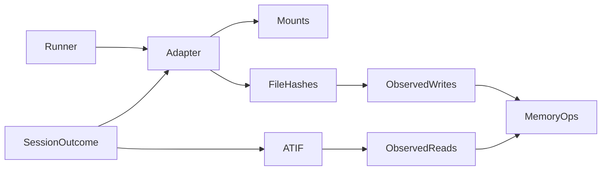

# adapters specification

Memory adapters own storage injection, snapshots and observations. No new backend
is required for MemoryArena.

## Current Architecture

## Target Architecture

An optional observe_execution(session, outcome) hook preserves existing adapters.
Directory adapters compare hashes captured at injection and completion. Each changed
file is one observed write, with before/after hashes, not a claim about every write.
Successful structured Read results must match the mounted path and a tool call ID.
Failed tools, prompt mentions and arbitrary Bash text do not establish a read.
Missing evidence is explicitly unmeasured. Host setup/injection/snapshots are never
counted as agent use. Observation must not mutate persistent memory or retry actions.
