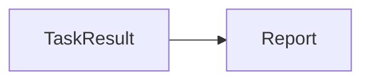
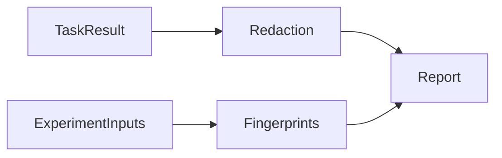

# artifacts specification

Sanitized execution reports and reproducible control fingerprints.

## Current Architecture

## Target Architecture

Dependencies follow GOVERNANCE.md. Missing evidence retains an explicit status;
official benchmark scoring, derived metrics and execution status remain separate.

Task Markdown explicitly renders unmeasured memory reads/writes as n/a and labels
observed counts as lower bounds, matching the nullable JSON fields.
