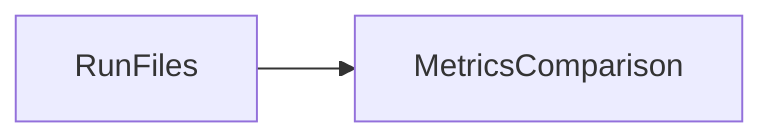
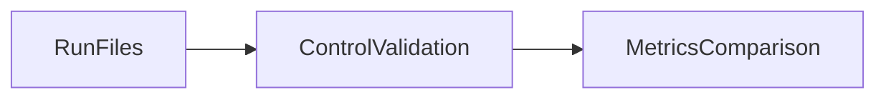

# comparison specification

Compare only explicitly measured results and validate controlled inputs.

## Current Architecture

## Target Architecture

Dependencies follow GOVERNANCE.md. Missing evidence retains an explicit status;
official benchmark scoring, derived metrics and execution status remain separate.
