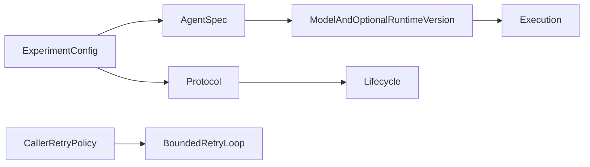

# Core configuration

## Current Architecture

## Target Architecture

Expose an optional installed-agent version, passed unchanged to the execution
boundary. Core does not import Harbor or branch on benchmark names. Existing
configs retain their behavior when a version is absent.

The shared retry loop accepts a caller-supplied error predicate. Callers with
non-idempotent requests choose their own delivery policy without benchmark or
backend branches in core; the default retry behavior remains compatible.
