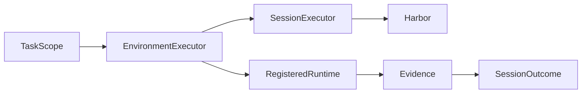
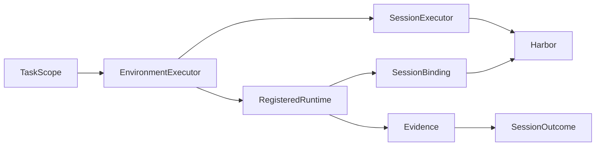

# Execution specification

Execution runs one agent session and captures raw outcomes, without choosing a
memory backend or computing benchmark scores.

## Current Architecture

## Target Architecture

SessionExecutor.task_scope is an optional resource lifetime, defaulting to the
existing stateless executor. EnvironmentExecutor decorates real execution; mock
does not start services. Runtime bindings carry generic mounts, environment
variables and instructions. Environment types never appear in HarborBridge.

Missing Harbor is a preflight failure, not an implicit mock experiment. Trial
failure remains failure even if partial output is recoverable.
