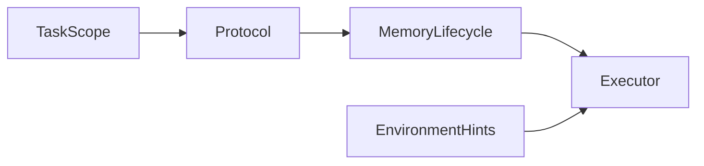
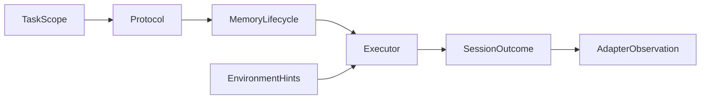

# lifecycle specification

Environment guidance is independent of memory policy. Task scopes own resources;
failed/partial status is explicit. Transfer directories are isolated per attempt,
and session bindings cannot accumulate across rounds.

## Current Architecture

## Target Architecture

ParallelTaskRunner enters the executor's task scope after checkpoint selection.
Scope exit must run on exceptions and cancellation. It does not import providers
or any specific runtime. SessionRunner retains independent memory policy and
continues collecting completed outcomes; execution failure status is explicit.

After assigning trial_dir, SessionRunner supplies the completed outcome to the
optional memory observation hook only for sessions where the adapter was injected.
The runner does not inspect ATIF, file paths or any benchmark-specific state.

The local contract above is implemented. Remaining end-to-end work and boundaries
are in the root PLAN.md and docs/datasets/memoryarena.md. Dependencies follow
GOVERNANCE.md; benchmark differences do not belong in the session runner.
