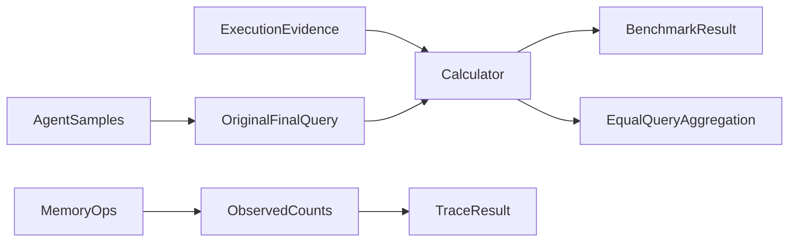

# metrics specification

Shopping requires host-observed purchases. Travel requires named plans and uses
official reward evidence in managed runs. Repeated queries align by session ID.
Reasoning supports paper-weighted aggregation and per-k curves. Missing execution
or judging remains unmeasured, distinct from a measured incorrect answer.

## Current Architecture

## Target Architecture

Search's final combined question is the official scoring unit. Earlier questions
build context and memory; they do not contribute to official accuracy. Truncation
or missing final execution leaves the official score unmeasured. Aggregate complete
queries with equal weight regardless of their number of context questions.

The Search correction and official aggregation parity are verified. Runtime boundaries
are in the root PLAN.md and docs/datasets/memoryarena.md. Dependencies follow
GOVERNANCE.md; benchmark differences do not belong in the session runner.

Trace metrics count only observed reads/writes. Unknown values are omitted from
numeric bundles and remain null in TraceResult. Evidence source and lower-bound
semantics appear in details; no events cannot prove that no memory was used.
