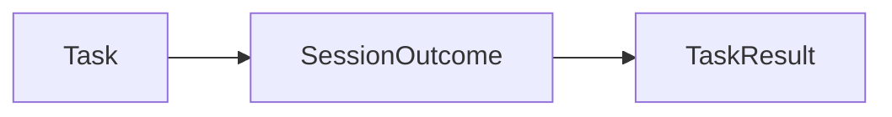
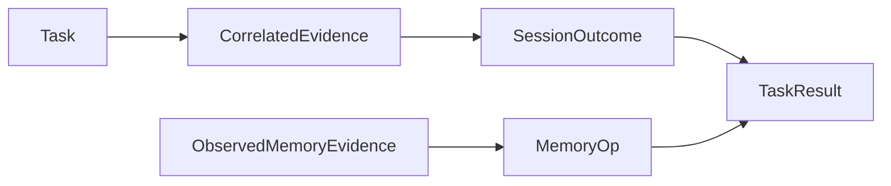

# models specification

Typed boundaries for tasks, runtime evidence and evaluation results.

## Current Architecture

## Target Architecture

Dependencies follow GOVERNANCE.md. Missing evidence retains an explicit status;
official benchmark scoring, derived metrics and execution status remain separate.

MemoryOp carries optional evidence source and metadata. Trace memory fields are
nullable: positive observed counts are lower bounds; missing evidence is not zero.
