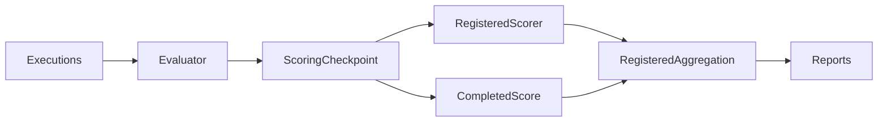

# pipeline specification

Evaluate completed evidence and delegate aggregation to benchmark policies.

## Current Architecture

## Target Architecture

Dependencies follow GOVERNANCE.md. Missing evidence retains an explicit status;
official benchmark scoring, derived metrics and execution status remain separate.

Scoring checkpoints key task evidence, judge/data configuration, relevant source
code and dependency versions. Reserve an attempt durably before invoking the
scorer; atomically persist a redacted result. Completed results may be reused on
resume. Incomplete/corrupt attempts fail closed, with no automatic judge replay.
This policy is independent of benchmark and backend; fresh evidence or settings
produce a different key. Pure derived metrics can be recomputed from execution.

Trace aggregation excludes unmeasured memory-use values from its denominator and
reports observation coverage. An entirely unmeasured metric is omitted.
