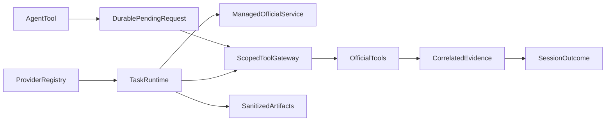

# task_environments specification

The runtime owns verified official worker processes and task/session bindings.
ArenaClient implements explicit HTTP lifecycle without mutation replay. Scenario
strategies supply official tools and host references behind a scoped gateway.

## Current Architecture

## Target Architecture

TaskRuntime owns services and one official environment; it never owns memory.

The agent client journals one pending logical request per session capability before
sending it. A retry after uncertain delivery reuses that request ID; different
actions cannot bypass a pending request. A confirmed response permits a subsequent
intentional action with a new ID. A process lock serializes journal changes. The
gateway caches handler errors as well as successes, so ambiguous mutations are
not repeated within the same session capability.

The owned bootstrap configures the official factory's newly created OpenAI or
Anthropic SDK client with max_retries=0 before exposing the environment. This is
transport configuration; official source and judging algorithms remain unchanged.
Runtime provenance records the policy. External model gateways must also disable
automatic retry/failover for an experiment that claims no inference replay.

Preparation follows the selected official Search implementation (BM25 directory or
dense index/id-map/corpus). Tokenized Search snippets use an explicit pinned offline
Hugging Face tokenizer cache; its revision and files join asset provenance. Shopping
can select an explicitly fingerprinted items file for a bounded transport smoke;
this does not establish a full-catalog benchmark score.
The executor decorator opens the runtime per task and binds/finishes sessions.
Public tools have bounded requests and session capabilities, and cannot reset,
close, select a different task, or submit their own grading reference. Upstream
control responses stay host-side. Transport and service failures are explicit.

The local contract above is implemented. Remaining end-to-end work and boundaries
are in the root PLAN.md and docs/datasets/memoryarena.md. Dependencies follow
GOVERNANCE.md; benchmark differences do not belong in the session runner.
