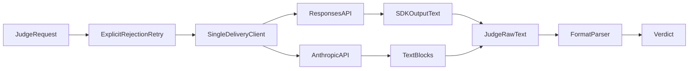

# verifier specification

Search parser supports the official plain and two bold-label formats. Raw confidence
and parse errors remain available to the Search calculator. Protocol clients must
extract final answer text without treating reasoning summaries as judge answers.

## Current Architecture

## Target Architecture

The OpenAI Responses path must use the SDK output_text accessor, which collects
output_text content from message items. Reading message.text loses valid answers;
reasoning items and refusals must not become final judge text. Unsupported-endpoint
fallback and actual authentication errors retain their existing behavior.

SDK automatic retries must be disabled. Timeout, connection loss and server errors
can follow completed inference; do not replay those requests. Only an explicit
rate-limit rejection may be retried within the configured bound. Responses-to-chat
fallback requires an explicit unsupported-endpoint rejection, not arbitrary error
text from an uncertain delivery. Requested num_runs remains deliberate judging.

Remaining end-to-end work and boundaries
are in the root PLAN.md and docs/datasets/memoryarena.md. Dependencies follow
GOVERNANCE.md; benchmark differences do not belong in the session runner.
